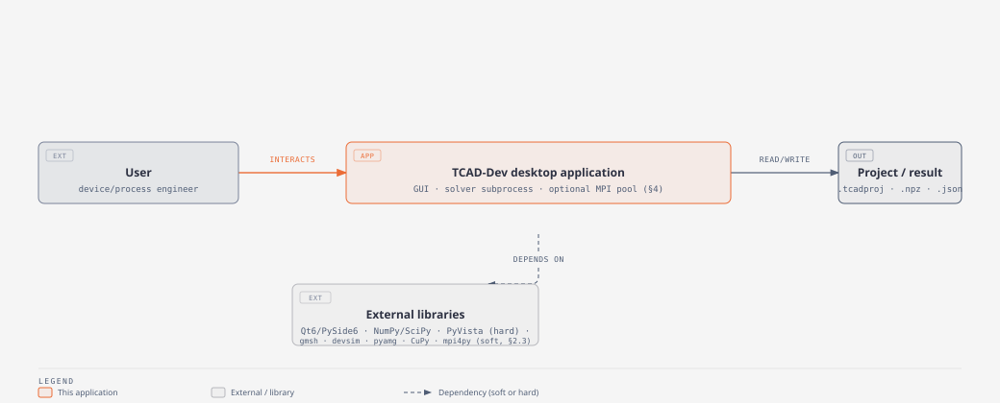
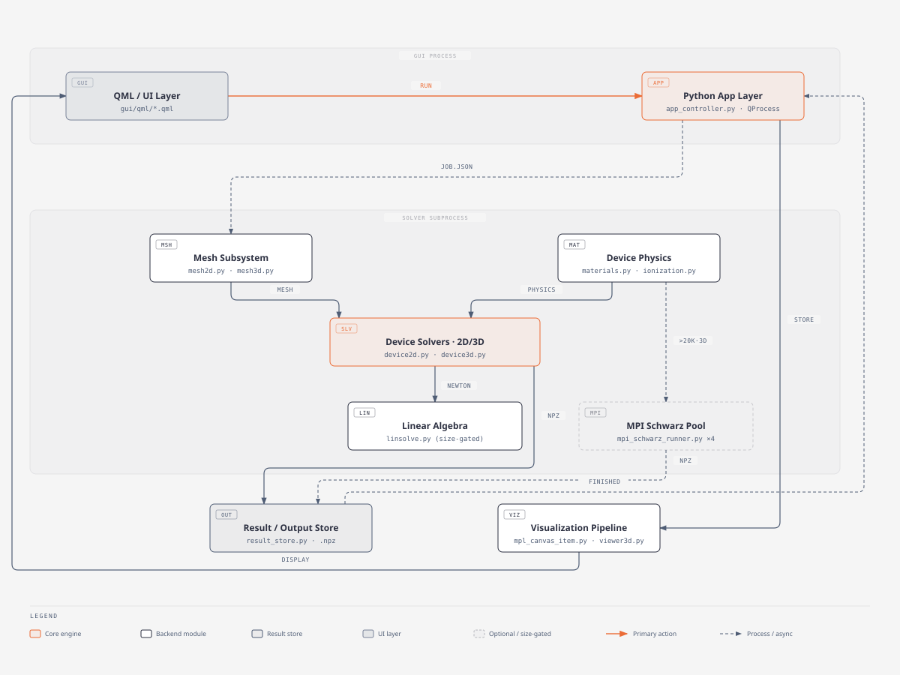
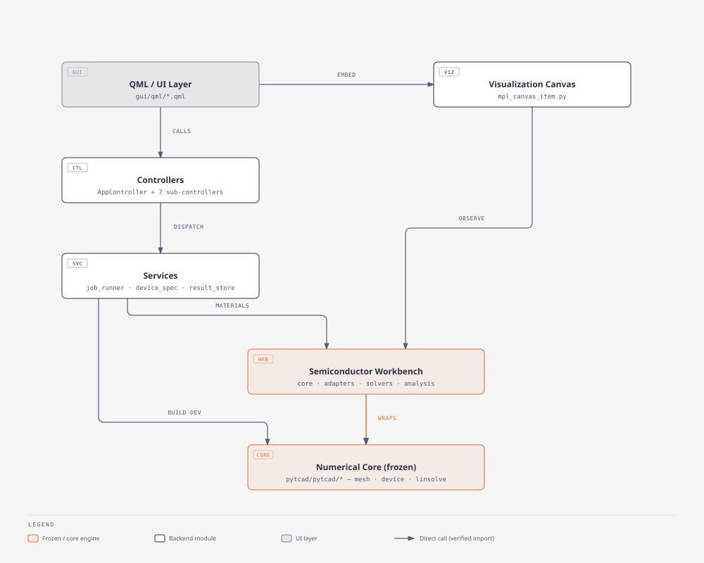
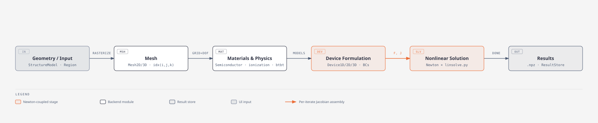
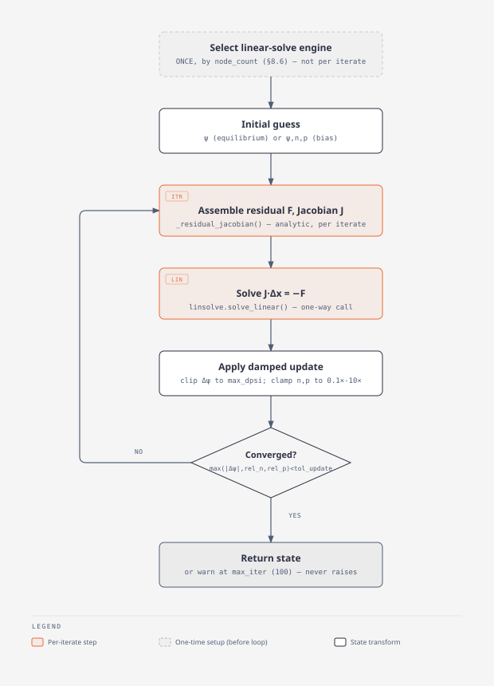
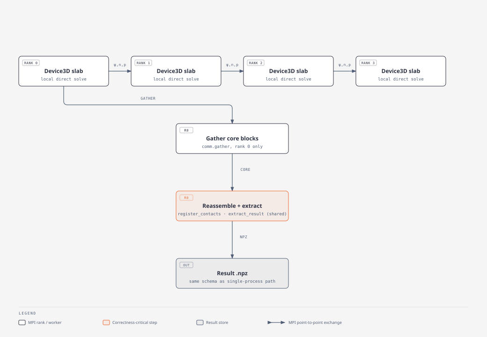
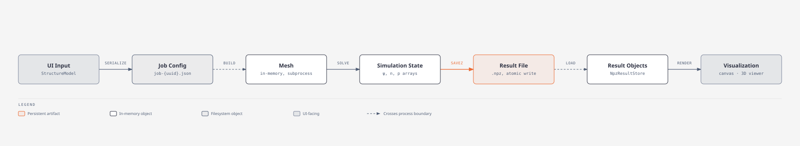
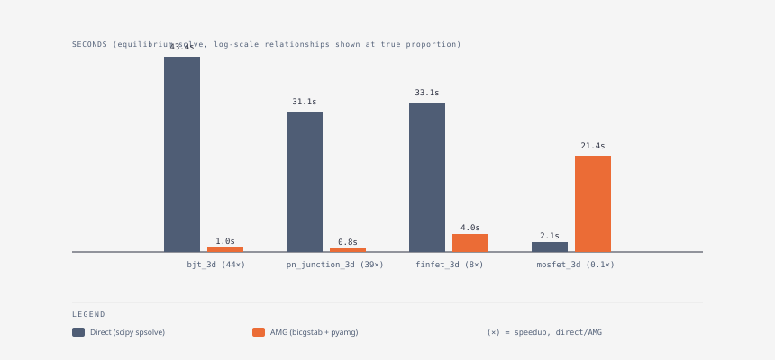

> **How to read this document.** Every architectural claim below is either (a) cited to an exact file and line number in this repository, or (b) explicitly marked **"Not verified in the repository"**. Where two sources disagree (a code comment vs. a planning document, a stated design intent vs. actual repo state), both are shown and the conflict is flagged rather than silently resolved. Line numbers were correct as of the 2026-09-05 commit this guide was built against (`git log` head: `2ab8c2b`) and will drift as the code evolves — treat them as pointers to re-locate, not eternal truths.
>
> This document was produced by directly reading the source (`pytcad/pytcad/*.py`, `pytcad/gui/**/*.py`, `pytcad/workbench/**/*.py`, `pytcad/gui/qml/**`), cross-checking two existing repo documents (`AGENTS.md`, a human-authored brief for AI agents working on this repo, and `ARCHITECTURE.md`, an earlier planning document) as **secondary** references only, and discarding/flagging anything those documents claimed that the code did not support.

---

# 1. Executive Summary

## 1.1 What the application does

PyTCAD is a **TCAD (Technology Computer-Aided Design) toolkit**: it numerically solves the semiconductor drift-diffusion equations (Poisson's equation coupled to electron/hole continuity) over 1D, 2D, and 3D device geometries, plus a separate fabrication-**process** simulator (implant/anneal/oxidize steps that produce a doping profile). It ships two front ends over the same numerical core:

- A **desktop GUI** (`pytcad/gui/`, PySide6/QML) — a "Semiconductor Workbench" where a user builds a device structure or a process flow, configures a solve (DC bias, voltage sweep, transient, small-signal AC), runs it, and inspects results (I-V curves, field maps, band diagrams, 3D isosurfaces).
- A **library/script path** (`pytcad/pytcad/`, plus `pytcad/workbench/` domain objects and `pytcad/examples/`) usable directly from Python or a small text DSL (`workbench/workflow.py`), independent of the GUI.

Every educational/GUI surface is backed by real, gated numerical computation — this is a stated hard rule of the project (AGENTS.md:32: "Every educational surface must be backed by real computation. Never fake, never mock, never weaken tests.").

## 1.2 Primary execution model

The GUI is **one process**; every solve runs in a **separate OS subprocess**, and for large 3D jobs that subprocess can itself spawn a **pool of MPI worker processes**. This is a three-tier process model, not two:

1. **GUI process** — Qt/QML event loop (`pytcad/gui/app.py`), never blocks on numerics.
2. **Solver subprocess** — spawned per run via `QProcess` (`gui/services/job_runner.py:91-92`), running `python -m gui.services.solver_runner <job.json> <result.npz>`. Communication is entirely through two files and stdout/stderr text markers — no shared memory, no RPC.
3. **MPI worker pool** (conditional) — spawned *from inside* the solver subprocess via `subprocess.Popen(["mpirun", "-np", "4", ...])` (`solver_runner.py:842-851`) only when a job is 3D, exceeds 20,000 mesh nodes, and has a "safe" domain-decomposition axis. The GUI process and even the `JobRunner` in tier 1 are structurally unaware this tier exists (`mpi_schwarz_runner.py` module docstring, and `solver_runner.py`'s own comment: "JobRunner and AppController stay completely unaware MPI is involved at all").

Rationale for the subprocess boundary (not a thread): PyTCAD's Newton loops are synchronous, spend their time inside SciPy's C-level sparse LU, and have no cancellation hook — a Python thread there cannot be safely interrupted or killed. A process can be (`job_runner.py:1-9`, module docstring).

## 1.3 Major subsystems

| Subsystem | Location | One-line role |
|---|---|---|
| QML/UI layer | `gui/qml/` | Presentation only; binds to Python controller properties/signals, never imports `pytcad` |
| Controllers | `gui/controllers/` | Per-domain Qt object graph exposed to QML; orchestrate services, own no physics |
| Services | `gui/services/` | Subprocess management, wire-format serialization (`DeviceSpec`), result loading, project persistence |
| **Semiconductor Workbench** (`workbench/`) | `pytcad/workbench/` | Domain objects (`Region`, `DomainDevice`), a `SolverBackend` protocol (pytcad + optional devsim), analysis observables, a deck DSL — the sanctioned indirection layer between GUI/services and the numerical core (confirmed load-bearing, not legacy — §3.3) |
| Numerical core | `pytcad/pytcad/` | Mesh, materials, 1D/2D/3D device solvers, linear algebra, transient/AC/thermal/density-gradient extensions — frozen except by explicit milestone amendment (AGENTS.md:106-109) |
| MPI/Schwarz HPC path | `gui/services/mpi_schwarz_runner.py` | Optional, size-gated domain-decomposition solve for large 3D jobs |
| Visualization | `gui/visualization/mpl_canvas_item.py`, `gui/services/viewer3d.py` | 2D Matplotlib-in-QML canvas (always present) + optional separate PyVista/VTK 3D window |

## 1.4 Main simulation lifecycle

```
QML action → AppController.run() → DeviceSpec (JSON) → QProcess subprocess
  → mesh + materials → Device1D/2D/3D Newton solve (→ linsolve, → optionally MPI/Schwarz)
  → result arrays → atomic .npz write → JobRunner.finished
  → NpzResultStore → QML canvas / 3D viewer
```
Each arrow above is a verified, cited transition — detailed in §4, §6, §8, §9, §10, §11.

## 1.5 Key architectural characteristics and constraints

- **Strict layering, stated as a hard rule** (AGENTS.md:110-111): `QML -> controllers -> services -> QProcess subprocess -> npz -> ResultStore -> canvas`. Controllers and the visualization canvas **never import `pytcad` directly** — they go through `workbench/` (confirmed: `mpl_canvas_item.py` imports `workbench.core.materials`/`workbench.analysis.observables`, never `pytcad.materials` directly).
- **Numerical core is frozen** except where an explicit, gated milestone plan amends it (AGENTS.md:106-109). This is a project governance rule, not a technical one, but it shapes where new work is expected to land (`workbench/`, `gui/`, or a new milestone plan — not silent edits to `device.py`).
- **`DeviceSpec` is the one wire format** across the GUI↔subprocess boundary, and (separately) `DomainDevice` is the workbench's in-memory device representation, convertible losslessly to/from `DeviceSpec` via `workbench/adapters/spec.py`.
- **Subprocess isolation is per-run**: every `Run` click spawns a fresh subprocess with a fresh uuid-named job/result file pair (`job_runner.py:74-78`); nothing persists across runs in-process.
- **Optional dependencies degrade, never break**: gmsh, devsim, pyamg, CuPy, mpi4py+mpirun are all soft-imported (`importlib.util.find_spec` or try/except patterns) and each absence routes to a slower-but-correct fallback, never a crash or a silently wrong answer — with one documented exception: PyVista/pyvistaqt are a **hard**, unconditional dependency of `gui/` (AGENTS.md:115-121, confirmed in `requirements.txt` and `viewer3d.py`'s module-level import).
- **No CI.** Testing is a manual, local, human-run process (§13, §15) — confirmed by the complete absence of any `.github/workflows/` or other CI configuration in the repository.
- **Convergence is judged by Newton *update* size, not residual.** Every one of Device1D/2D/3D's six solve paths (equilibrium × bias, ×3 dimensionalities) converges on `max(|Δψ|, ...) < NewtonOptions.tol_update`; a separate `tol_residual` field exists in `NewtonOptions` but is dead code — declared once, read nowhere (§8.4).

# 2. System Context

## 2.1 Plain-language view

A user interacts with a desktop window. Behind that window, three kinds of things happen: (1) the window itself redraws and reads what you typed — that's the GUI process; (2) when you click Run, a second, completely separate program is launched to do the actual number-crunching, and it talks back only by writing files and printing status lines — that's the solver subprocess; (3) if the job is a big 3D one, that second program can launch a *pool* of four more programs that split the problem into slices and talk to each other directly (via MPI) — the GUI never knows this third tier exists. When the numbers are done, they land in a file on disk, and the GUI reads that file back to draw plots.

## 2.2 System context diagram



*Diagram source: `docs/diagrams/01-system-context.html`. Verified against: `gui/app.py`, `job_runner.py`, `solver_runner.py`, `result_store.py`, `mpl_canvas_item.py`, `viewer3d.py`.*

## 2.3 Inside vs. outside the application

**Inside** (this repository):
- `pytcad/gui/` — GUI process, controllers, services, visualization.
- `pytcad/workbench/` — domain layer.
- `pytcad/pytcad/` — numerical core.
- `pytcad/examples/`, `pytcad/tests/`, `pytcad/gui/tests/` — usage examples and test suites.

**Outside** (external runtime dependencies, per `pytcad/requirements.txt`, full file read by the results/ops research fork):

| Dependency | Role | Optional? | Evidence |
|---|---|---|---|
| PySide6 ≥6.11 | Qt6/QML bindings | Hard | requirements.txt |
| NumPy ≥2.0, SciPy ≥1.14 | Array ops, sparse linear algebra (`spsolve`, `gmres`, `bicgstab`, `spilu`) | Hard | requirements.txt; `linsolve.py:21` |
| Matplotlib ≥3.9 | 2D plotting, embedded via Agg backend into the QML canvas | Hard | `mpl_canvas_item.py` |
| PyVista ≥0.48 / pyvistaqt ≥0.12 | 3D isosurface/volume rendering window | **Hard**, despite looking optional (AGENTS.md:115-121, confirmed unconditional module-level import in `viewer3d.py`) | requirements.txt L24-27 |
| pytest ≥9.0, pytest-xdist, pytest-timeout | Test runner | Hard (dev) | requirements.txt |
| gmsh ≥4.15 | Unstructured 2D/3D meshing | Soft (`_require_gmsh()`, call-time `ImportError`) | `gmsh_mesh.py:30-35` |
| devsim ≥2.11 | Alternate 1D solver backend | Soft (`_require_devsim()`, try/except) | `devsim_backend.py:38-45` |
| pyamg ≥5.0 | Algebraic multigrid preconditioner for large 3D equilibrium | Soft (`_HAVE_PYAMG`, try/except import) | `linsolve.py:23-27` |
| mpmath ≥1.4 | Reference-value tests for Fermi-Dirac integrals | Soft, test-only | requirements.txt |
| CuPy (`cupy-cuda12x`) | GPU direct solve (`gpu_direct`) | Soft, **not in requirements.txt** — installed separately to match local CUDA | `linsolve.py:57-58`; requirements.txt comment block L34-64 |
| mpi4py ≥3.1 + an MPI runtime (`mpirun`) | MPI/Schwarz domain decomposition | Soft, **not in requirements.txt** | `solver_runner.py:40-41`; requirements.txt comment block |
| Google Fonts (Instrument Serif, Geist, Geist Mono) | Used only by this guide's own diagrams, not the application | N/A | diagram-design skill |

## 2.4 User → GUI → application → simulation → results → visualization

1. **User** interacts with QML panels (e.g. `ACPanel.qml`, `StructurePanel.qml`).
2. **GUI process** (`gui/app.py`) holds the Qt event loop and the `AppController` (`app_controller.py`), which owns the domain/session state.
3. **Application layer** (`AppController` + `workbench/`) turns UI state into a `DeviceSpec` (wire format).
4. **Solver subprocess** (`solver_runner.py`) builds a mesh + device from that spec and runs a Newton solve — optionally fanning out to the **MPI worker pool** for large 3D jobs.
5. **Results** are written atomically as `.npz` (or `.json` manifest for process-flow runs) and read back into a `ResultStore`.
6. **Visualization** (`MplCanvasItem`, optionally `Viewer3DWindow`) renders the `ResultStore`'s contents back into the GUI.

---

# 3. Component Architecture

Each subsystem below is documented with: responsibility, source location, key classes/functions, inputs, outputs, dependencies, callers, major failure modes, and in-process vs. out-of-process. Process/execution detail (boundaries, lifetimes) is expanded further in §4.

## 3.1 QML/UI layer

- **Responsibility**: presentation only — renders panels, binds to Python-exposed properties/signals, forwards user actions as method calls. Never computes, never imports `pytcad`.
- **Source**: `pytcad/gui/qml/Main.qml` (app shell), `pytcad/gui/qml/qml/panels/*.qml` (15 files: ACPanel, BandDiagramPanel, ConsolePanel, DeviceTemplatesPanel, MeshPanel, PhysicsLabPanel, ProbeStationPanel, ProcessPanel, ProjectTreePanel, PropertiesPanel, SolverTelemetryPanel, StructurePanel, SweepPanel, TransientPanel, ViewportPanel), `pytcad/gui/qml/qml/components/*.qml` (18 files, e.g. `DopingEditor`, `MeshEditor`, `GateEditor`, `MainToolBar`, `ValidationBanner`), `Theme.qml`, `Icons.qml`, `qmldir`.
- **Key elements**: `property var controller` pattern on every panel (confirmed on `ACPanel.qml:16`); registered custom QML type `PyTCAD.MplCanvas` (`gui/app.py:33`) backing `ViewportPanel.qml`'s embedded canvas.
- **Inputs**: user interaction events; Python-side `@Property`/`Signal` values via context properties.
- **Outputs**: method calls into `appController`/`physicsLab`/`deviceBuilder`/`stateValidator` (the four context properties set in `gui/app.py:51-57`).
- **Dependencies**: PySide6/QML runtime only.
- **Callers**: none (leaf of the call graph, driven only by the user and by Qt's own event loop/binding system).
- **Failure modes**: a controller property that is a plain Python attribute (not `@Property(QObject)`) is invisible to QML and silently fails to bind (AGENTS.md gotcha, corroborated by controller code patterns); a boolean binding built from `&&`/ternary can hand QML a raw `null` instead of `false`, logging "Unable to assign [undefined] to bool" (AGENTS.md). **`ValidationBanner.qml` exists but is not instantiated anywhere in the QML tree** (`grep -rln "ValidationBanner" qml/` returns only its own file) — confirmed dead/unused component.
- **Process**: in-process with the GUI (tier 1).

## 3.2 Controllers — `gui/controllers/`

- **Responsibility**: the Qt object graph exposed to QML; one hub (`AppController`) plus per-domain controllers that each own a narrow slice of session state and delegate to services.
- **Source & key classes**: `app_controller.py:53` `AppController(QObject)` (2052 lines); `lab_controller.py:75` `PhysicsLabController`; `builder_controller.py:12` `BuilderController`; `family_sweep_controller.py:23` `FamilySweepController`; `cv_controller.py:31` `CVController`; `probe_station_controller.py:98` `ProbeStationController`; `solver_telemetry_controller.py:30` `SolverTelemetryController`; `band_diagram_controller.py:29` `BandDiagramController`.
- **Inputs**: QML method calls; `JobRunner` signals; `workbench/` domain objects.
- **Outputs**: `DeviceSpec` JSON (via services), Qt signals back to QML (`resultChanged`, `errorRaised`, `statusChanged`, etc. — full list at `app_controller.py:54-65`).
- **Dependencies**: `gui/services/*`, `workbench/*` — **never `pytcad/*` directly** (layering rule, AGENTS.md:110-111, corroborated by grep).
- **Callers**: QML (see §3.1) and, for `SolverTelemetryController`, the `AppController`'s own `_runner`'s `iterationChanged`/`residualChanged` signals (it does not run its own subprocess).
- **Failure modes**: context-property controllers must be Qt children of their parent controller or shutdown GC races QML bindings (AGENTS.md); `AppController` owns **three independent `JobRunner` instances** (`_runner`, `_process_runner`, `_comparison_runner`) that must not cross-wire their result stores (confirmed distinct in `app_controller.py:92,106,118-123`).
- **Process**: in-process with the GUI (tier 1). Controllers *trigger* out-of-process work (tier 2/3) but do not themselves run in a subprocess.

## 3.3 Services — `gui/services/`

- **Responsibility**: everything that isn't UI or physics — subprocess lifecycle, wire-format serialization, project persistence, result loading.
- **Source & key classes**: `job_runner.py:43` `JobRunner(QObject)`; `device_spec.py` (`DeviceSpec`, `MeshSpec`, `DopingSpec`, `ContactSpec`, `SweepSpec`, `WaveformSpec`, `TransientSpec`, `ACSpec` — all `@dataclass`); `structure_model.py` (`StructureModel`, `MeshModel`); `project_store.py` (`save_project`/`load_project`, `SCHEMA_VERSION=5`); `process_runner.py`/`process_model.py`/`process_result_store.py` (fab-process path); `gui_state_validator.py:` `GuiStateValidator`; `solver_runner.py` (the actual subprocess entry point — described fully in §4/§6); `mpi_schwarz_runner.py` (the MPI worker entry point — §9); `result_store.py` (`ResultStore` ABC + `NpzResultStore`/`SpecResultStore`); `viewer3d.py` (`Viewer3DWindow`).
- **Inputs**: `DeviceSpec` from controllers; `.npz`/`.json` result files from subprocesses.
- **Outputs**: `job-*.json` files, `.npz`/`.json` result files, `ResultStore` objects, Qt signals.
- **Dependencies**: `workbench/` (materials, solver backend protocol), `pytcad/` (only from *within* the subprocess entry points — `solver_runner.py`, `mpi_schwarz_runner.py`, `process_runner.py`, which run out-of-process, not from the in-process service classes).
- **Callers**: controllers (§3.2).
- **Failure modes**: see §4 (process lifecycle) and §10 (interfaces) for the full IPC failure contract.
- **Process**: `JobRunner`/`ResultStore`/`GuiStateValidator`/etc. are in-process (tier 1); `solver_runner.py`/`mpi_schwarz_runner.py`/`process_runner.py` are the *code that runs* in tiers 2/3 respectively, even though they live in this same directory.

## 3.4 Semiconductor Workbench — `pytcad/workbench/`

- **Responsibility**: the domain/indirection layer between GUI and numerical core. **Confirmed load-bearing and actively used by the production GUI path** — not legacy, not a separate/unused layer (verified by grepping every `workbench` import across `gui/`).
- **Source & key classes**:
  - `core/region.py:16` `Region` (rectangle of uniform doping); `core/device.py:82` `DomainDevice` (authored-or-imported device representation, `validate()` at 115-209); `core/catalog.py` `ModelCatalog`/`ModelInfo` (metadata registry whose `default_config()` returns exactly `DeviceSpec._default_models` — "adopting the catalog changes no solver behavior", catalog.py:11); `core/materials.py:16` `MaterialLibrary` (a name→`Semiconductor`-instance registry wrapping `pytcad.materials` — **the same class** imported by `solver_runner.py:139`, `app_controller.py:416,1039`, `mpl_canvas_item.py:987`); `core/templates.py` `TEMPLATES` dict — **exactly** `pn_diode, mos_capacitor, nmos, hemt, hbt` (no `mosfet_2d` template — that device is a hand-built `DeviceSpec` in `gui/services/examples.py:829`, a separate mechanism).
  - `adapters/spec.py` — `domain_from_device_spec`, `domain_from_structure`, `structure_from_domain`, `spec_from_domain` (208) — converts between `DomainDevice` and the **same** `DeviceSpec`/`StructureModel` the GUI serializes (confirmed via `examples.py:103`).
  - `adapters/process.py` — `domain_from_process_state`/`domain_from_process_store`, used by `process_result_store.py:70`.
  - `solvers/base.py` — `SolveRequest` (frozen dataclass: `job_json_path`, `out_npz_path`), `SolverBackend` Protocol, `PytcadBackend` (a thin wrapper whose `run()` calls `gui.services.solver_runner.run_job()` directly — not a second solve path), `get_backend`/`backend_ids`.
  - `solvers/devsim_backend.py` — `_require_devsim()` (lazy import), `check_devsim_compatible(spec)` (the single compatibility gate, reused by both the backend and the GUI's selector), `DevsimBackend` (a genuinely separate numerical implementation using `devsim.python_packages.simple_physics`, 1D/2-ohmic-contact only).
  - `analysis/observables.py` — `current_extremes`, `on_off_ratio`, `threshold_voltage_max_gm`, `gm_curve`, `band_diagram`, `recombination_rate` — post-processing over **already-solved** field arrays, called directly by `mpl_canvas_item.py:1003,1037,1052`.
  - `physics/impact_ionization.py`, `physics/tunneling.py` — explicitly analysis/diagnostic-only, **not coupled to the Newton solvers** (docstring, impact_ionization.py:13-15); re-export coefficient tables from `pytcad/ionization.py` as "single source of truth" rather than duplicating them.
  - `workflow.py` — a plain-text deck DSL (`TEMPLATE`/`BIAS`/`SWEEP` statements), `run_deck_full`/`run_deck`, `DeckRun` dataclass. Reachable from the GUI via `AppController.runDeck(text)` (~`app_controller.py:1811-1817`), which converts the result back into the **same** Structure session the GUI already edits ("Never a second simulation path", inline comment).
- **Inputs**: `DomainDevice`/`Region`/deck text from the GUI's Builder/deck-import path, or from example scripts.
- **Outputs**: `DeviceSpec` (for the pytcad solve path) or a `devsim`-native result (for the devsim backend).
- **Dependencies**: `pytcad/materials.py` (wrapped, not reimplemented), `pytcad/ionization.py`/`btbt.py` (re-exported), optionally `devsim`.
- **Callers**: `app_controller.py` (6 distinct import sites), `builder_controller.py`, `lab_controller.py`, `solver_runner.py` (materials + devsim dispatch), `examples.py`, `process_result_store.py`, `mpl_canvas_item.py`.
- **Failure modes**: `check_devsim_compatible` raising for an incompatible spec (non-1D, non-2-ohmic-contact); `MaterialLibrary.get()` raising `KeyError` with the available-names list for an unknown material.
- **Process**: in-process with whichever tier calls it — most calls are tier 1 (GUI), but `solver_runner.py`'s own `MaterialLibrary`/`SolverBackend` use happens inside tier 2 (the subprocess).

## 3.5 Numerical core — `pytcad/pytcad/`

Covered in full detail in §7 (mesh/materials/physics) and §8 (Newton/Jacobian/linear algebra). Summary table:

| Module | Responsibility |
|---|---|
| `mesh.py`, `mesh2d.py`, `mesh3d.py` | Structured rectilinear mesh generation, 1D/2D/3D |
| `gmsh_mesh.py`, `gmsh_mesh3d.py`, `unstructured_assembly*.py`, `unstructured_poisson.py`, `unstructured_dd.py` | Optional unstructured (gmsh-based) mesh + solve path |
| `adapt.py`, `adapt_unstructured*.py` | Adaptive mesh refinement (heuristic indicators + Dörfler marking) |
| `materials.py` | `Semiconductor` dataclass + mobility/BGN/recombination physics models |
| `ionization.py`, `btbt.py` | Impact ionization (van Overstraeten–de Man), band-to-band tunneling (Kane/Hurkx) — Jacobian-coupled |
| `fermi.py` | Fermi-Dirac statistics (tabulated + exact quadrature) |
| `device.py`, `device2d.py`, `device3d.py` | 1D/2D/3D drift-diffusion Newton solvers — the core |
| `linsolve.py` | Linear algebra dispatch (direct/iterative/GPU) + preconditioners |
| `transient.py`, `transient2d.py` | Backward-Euler/theta-scheme time integration (drives Device1D/2D externally) |
| `ac.py`, `ac2d.py` | Small-signal Y-parameters via perturbed DC Jacobian |
| `dg.py` | Density-gradient quantum correction (Schrödinger-Poisson) |
| `thermal.py` | Self-heating outer Gummel loop |
| `continuation.py` | Bias-ramp continuation drivers — **test-only**, never called from production code (§8.9) |

- **Dependencies**: NumPy/SciPy only (plus optional gmsh/pyamg/CuPy at the edges).
- **Callers**: `solver_runner.py` and `mpi_schwarz_runner.py` (tier 2/3, the only production callers), and directly from `pytcad/tests/*` and `pytcad/examples/*`.
- **Process**: runs wherever it's imported — tier 2 (solver subprocess) for GUI-triggered solves, tier 3 (per-rank) for MPI jobs, or a plain script process for `pytcad/examples/*.py`.

## 3.6 MPI/Schwarz HPC path

Full detail in §9. Summary: `gui/services/mpi_schwarz_runner.py`, spawned via `mpirun -np 4` from inside the solver subprocess, only for 3D jobs >20,000 nodes with a doping-safe/gate-safe split axis.

## 3.7 Results / Visualization

- **Responsibility**: load solved arrays from disk into a typed in-memory object, then render them.
- **Source & key classes**: `result_store.py` — `ResultStore(ABC)`, `NpzResultStore`, `SpecResultStore` (pre-solve, doping-only), plus frozen dataclasses `MeshAxes`, `ScalarField`, `VectorField`, `TerminalCurrent`, `SweepResult`, `TransientResult`, `ACResult`, `SweepSnapshots`; `process_result_store.py` — `ProcessResultStore` (manifest-based, structurally different from `NpzResultStore`); `mpl_canvas_item.py:41` `MplCanvasItem(QQuickPaintedItem)` (registered QML type `PyTCAD.MplCanvas`); `viewer3d.py:167` `Viewer3DWindow` (PyVista/`pyvistaqt.QtInteractor`-backed, a separate top-level `QMainWindow`, not embedded in QML).
- **Inputs**: `.npz`/`.json` result files.
- **Outputs**: rendered 2D plots (into the QML canvas) or an interactive 3D window.
- **Dependencies**: Matplotlib (Agg backend), PyVista/VTK, `workbench.analysis.observables` (for band diagrams/recombination maps — not `pytcad` directly).
- **Callers**: `AppController._on_finished` (creates the store), QML `ViewportPanel.qml` (drives the canvas), `AppController.openViewer3d()` (opens the 3D window).
- **Failure modes**: a corrupted `.npz` raises `ResultSchemaError` at open time (`result_store.py:313-317`, via `validate_result`); `pyvistaqt.QtInteractor` cannot run under `QT_QPA_PLATFORM=offscreen` (raises an X11 `BadWindow` error, not a clean no-op — AGENTS.md, confirmed test workaround via a monkeypatched fake interactor).
- **Process**: in-process with the GUI (tier 1) — visualization never runs in the subprocess.

# 4. Process and Execution Architecture

## 4.1 Plain-language view

There are up to three separate OS processes involved in one solve: the always-running GUI, a solver process born and killed once per Run click, and — only for big 3D jobs — four more processes that live only for the duration of that one solve and talk to each other directly instead of through the GUI.

## 4.2 Process/execution diagram



*Diagram source: `docs/diagrams/02-process-execution.html`.*

## 4.3 Tier 1 — GUI process

- **Creation**: the OS process started by running `python -m gui.app` (AGENTS.md:83) or the packaged app entry point.
- **Lifetime**: for the life of the application window.
- **Startup** (`gui/app.py`, full file read by the backend-orchestration fork):
  - `main()` (L91-135): on Wayland with a `DISPLAY` set, defaults `QT_QPA_PLATFORM=xcb` **only if not already set** (L108-111, compatibility shim, never overrides an explicit choice). Sets `Qt.AA_ShareOpenGLContexts` (L128) **before** constructing `QApplication(sys.argv)` (L129).
  - **`QApplication`, not `QGuiApplication`, is load-bearing**: Qt's application-singleton class is fixed by whichever subclass constructs it first in the process and can never be upgraded afterward; the 3D viewer's `QMainWindow` (`viewer3d.py`) hard-**aborts the whole process** ("QWidget: Cannot create a QWidget without QApplication") if only a `QGuiApplication` exists (AGENTS.md, confirmed by reproduction, not just documentation — `gui/app.py:113-121` comment). This is why `gui/tests/conftest.py`'s session-scoped fixture also explicitly constructs `QApplication`.
  - `create_engine(app)` (L27-62): registers `PyTCAD.MplCanvas` (`qmlRegisterType`, L33); adds the `"icons"` image provider (L41); constructs `AppController`, calls `controller.setParent(engine)` **before** `setContextProperty("appController", controller)` (L50-51) — ordering matters: parenting first prevents Python GC from destroying the controller while QML bindings still evaluate during teardown; also exposes `"physicsLab"`, `"deviceBuilder"`, `"stateValidator"` (L52-57); loads `Main.qml` (L58); keeps `engine._controller = controller` (L61) as a belt-and-braces extra reference.
- **Shutdown**: `close_engine(engine)` (L65-88) destroys root `QWindow`s directly via `.destroy()` (not `.close()`, since `Main.qml`'s `onClosing` can veto via an unsaved-changes confirmation when `appController.isDirty`), then drains posted + `DeferredDelete` events for 10 rounds before the engine itself is torn down.
- **Error handling**: uncaught exceptions inside `AppController.run()` are caught locally and re-raised as `errorRaised` signal emissions (`app_controller.py`, try/except around `self._runner.start(self.spec)`) — the GUI process itself does not crash on a bad job.
- **Synchronization**: entirely event-driven via Qt's signal/slot mechanism; no explicit locks — Qt's own event loop serializes all controller-state mutation onto the GUI thread.

## 4.4 Tier 2 — Solver subprocess

- **Creation**: `JobRunner.start(spec)` (`job_runner.py:71-93`) — generates `run_id = uuid.uuid4().hex[:12]`, writes `job-{run_id}.json` via `spec.to_json(job_path)`, then `QProcess.start(sys.executable, ["-m", self._module, job_path, self.result_path])` (L91-92). `self._module` defaults to `"gui.services.solver_runner"`; `AppController` also runs a second `JobRunner` with `module="gui.services.process_runner"` for the fab-process path, and a third (`_comparison_runner`, same default module, own temp dir) for the M9 "all models off" comparison overlay.
- **Lifetime**: exactly one solve. A fresh subprocess is spawned per Run click — no pooling, no reuse (`job_runner.py`'s own module docstring: "Subprocess isolation per run", corroborated by AGENTS.md:112).
- **Entry point** (`solver_runner.py:1186` `main(argv)`): reads `job_path`/`out_path` from `sys.argv`, calls `run_job(job_path, out_path)` (L875), and on any exception prints `PYTCAD_ERROR=<json {error,message,traceback}>` to stderr (L1216) before exiting non-zero.
- **Progress reporting**: `print("PYTCAD_STAGE=<name>", flush=True)` lines on stdout at each phase transition (mesh build, equilibrium, bias, sweep point N/M, extract); `JobRunner._on_stdout` (`job_runner.py:110-134`) regex-parses these plus ad hoc `"it N |dpsi|=..."` Newton-progress lines (cosmetic only — "results always come from the .npz", module docstring L28-33) into `stageChanged`/`iterationChanged`/`residualChanged`/`progressLine` signals.
- **Completion signal**: on success, prints `RESULT_PATH=<out_path>` (`solver_runner.py:1183`) **after** an atomic write (`tmp_path = out_path + ".tmp.npz"`; `np.savez(tmp_path, **result)`; `os.replace(tmp_path, out_path)` — L1180-1182). `JobRunner._on_finished` (`job_runner.py:139-178`) requires **all three** of: `exit_code == 0`, the `RESULT_PATH=` line having actually been seen, and that path existing on disk — before emitting `finished`; any one failing routes to `failed` via `_parse_failure()` (scrapes `PYTCAD_ERROR=` from stderr).
- **Cancellation**: `JobRunner.cancel()` (`job_runner.py:95-107`) calls `QProcess.terminate()`, then a captured-process-specific 3-second grace `QTimer` force-`kill()`s if it hasn't exited (captures the *specific* process object, not `self._proc`, so a quick cancel-then-restart can't kill the fresh run instead — explicit comment). On cancel, any result file that raced into existence is force-removed (belt-and-braces, L160-164).
- **Cleanup**: `job-*.json` is removed on every outcome (success/failure/cancel) since nothing else ever deletes it (L149-153); `.tmp.npz`/`.tmp.json` orphans are cleaned (`_cleanup_tmp`); a process-runner's per-run `<result-stem>-state/` checkpoint directory is removed only on cancel/failure, never on success (`_cleanup_stale_state_dir`).
- **Failure modes**: non-finite input caught by `DeviceSpec` validation before any solve starts; Newton non-convergence (warned, not fatal — the solve still writes whatever it has); a size/dimensionality gating bug once broke every 1D/2D job by computing `doping.max(axis=2)` before checking `dimensionality==3` (AGENTS.md gotcha, now fixed) — illustrates that shared-dispatch-function changes need the *whole* suite run, not just the seemingly-relevant subset.
- **Process**: a full, independent OS process (`python -m gui.services.solver_runner`), out-of-process from the GUI.

## 4.5 Tier 3 — MPI worker pool (conditional)

- **Activation criteria** (`solver_runner.py:1006`, exact expression): `is_large_3d and _HAVE_MPI and split_axis is not None and spec.transient is None`, where `is_large_3d = (dimensionality==3) and (node_count > 20_000)` and `split_axis` comes from `_pick_mpi_split_axis(doping, spec)` (L759-814) finding at least one mesh axis that is both doping-uniform (varies <1% of the array's total range) and not a registered gate's `normal_axis`.
- **Launch**: `_solve_via_mpi_schwarz(job_path, split_axis)` (`solver_runner.py:817-872`) builds `mpirun [--allow-run-as-root if Open MPI] -np 4 python -m gui.services.mpi_schwarz_runner job.json tmp_out.npz <axis>` and runs it as a **child of the solver subprocess** via `subprocess.Popen` — i.e. this is a grandchild of the GUI process, not a sibling.
- **Lifetime**: exactly one Schwarz solve (equilibrium+bias, or a full sweep — mutually exclusive with the plain single-process path at the job level, never both).
- **Rank responsibilities**: every rank runs an *ordinary* single-process `Device3D` solve on its own mesh slab (`_build_local_device`, `mpi_schwarz_runner.py:205-244`); only rank 0 prints `PYTCAD_STAGE=`/does the final `.npz` write.
- **Shutdown**: `proc.wait()`; the parent (`_solve_via_mpi_schwarz`) checks `proc.returncode == 0 and os.path.exists(tmp_out)` and raises `RuntimeError` with the last 40 lines of relayed output on failure.
- **Synchronization**: `mpi4py.MPI` point-to-point `isend`/`recv` per Schwarz iteration (detailed in §9) plus a collective `allreduce(MAX)` for the convergence check.
- **Failure modes**: a split along an axis the device's doping actually varies along is a *regression*, not a speedup (documented, caught before shipping — `M22-LINSOLVE-PLAN.md:522-527`); a `GateBC`'s `normal_axis` hazard is a *second, independent* exclusion the doping check alone cannot see (a real bug found and fixed, AGENTS.md:264-281).
- **Process**: 4 independent OS processes (rank 0-3), children of the solver subprocess, siblings of each other, coordinated via MPI — not visible to, or launched by, the GUI process directly.

## 4.6 Cross-tier synchronization summary

| Boundary | Mechanism | Synchronous? |
|---|---|---|
| GUI ↔ solver subprocess | `QProcess` (argv + stdout/stderr text + two files) | Asynchronous (Qt signals on I/O ready) |
| Solver subprocess ↔ MPI pool | `subprocess.Popen` (argv + relayed stdout + one temp file) | Synchronous from the solver subprocess's point of view (`proc.wait()` blocks it) — but this call itself runs inside the already-asynchronous tier-2 subprocess, so it never blocks the GUI |
| MPI rank ↔ MPI rank | `mpi4py.MPI.COMM_WORLD` (`isend`/`recv`, `allreduce`) | Synchronous within the Schwarz loop (each iteration waits on outstanding sends before proceeding) |

---

# 5. Frontend Architecture

## 5.0 Frontend ↔ backend architecture diagram



*Diagram source: `docs/diagrams/03-frontend-backend.html`. Encodes the hard layering rule (AGENTS.md:110-111): `QML -> controllers -> services -> QProcess subprocess -> npz -> ResultStore -> canvas`, with `workbench/` as the confirmed mandatory indirection between controllers/canvas and the numerical core (§3.4).*

## 5.1 Plain-language view

QML files are pure layout and bindings — they hold a reference to a Python "controller" object and call its methods or read its properties; they contain no simulation logic. Python controllers are exposed to QML through Qt's property/signal system, registered once at startup.

## 5.2 QML structure

- `Main.qml` — app shell (existence and role confirmed via `gui/tests/conftest.py:38-41`'s reference to its `onClosing` handler; the exact internal composition lines for `MainToolBar`/`workbenchTabs`/`viewport`/`console` were not individually re-verified against `Main.qml`'s own body in this pass — flagged as **not fully verified**, though AGENTS.md's Layout section and every panel's binding pattern are consistent with it).
- `qml/panels/` (15 files) — each declares `property var controller` (confirmed pattern, `ACPanel.qml:16`) bound to a controller instance.
- `qml/components/` (18 files) — reusable widgets. **`ValidationBanner.qml` is dead code** (§3.1).
- `qml/Theme.qml` — theme tokens; toggled by pure-QML logic (`MainToolBar.qml:258`, `Theme.toggle()`), no controller round-trip needed for a theme switch.

## 5.3 Models exposed to QML

Seven `QAbstractListModel`/`QAbstractItemModel` subclasses in `gui/controllers/` (or an adjacent models module): `ConsoleModel`, `ContactListModel`, `GateListModel`, `PropertiesModel`, `ProcessStepListModel`, `RegionListModel` (all `QAbstractListModel`), and `ProjectTreeModel` (`QAbstractItemModel`, a genuine tree, with a helper `_Node` class). Exact `roleNames()`/backing-data detail per model: **Not verified in the repository** in this pass (class declarations and base classes confirmed; role wiring was not read).

## 5.4 Python ↔ QML communication mechanism

1. **Context properties** (`gui/app.py:51-57`): `appController`, `physicsLab`, `deviceBuilder`, `stateValidator` — set once at startup via `engine.rootContext().setContextProperty(...)`.
2. **Registered QML type**: `qmlRegisterType(MplCanvasItem, "PyTCAD", 1, 0, "MplCanvas")` (`gui/app.py:33`) lets QML instantiate `MplCanvas { }` directly inside `ViewportPanel.qml`.
3. **Property/Signal/Slot pattern**: every controller uses `from PySide6.QtCore import QObject, Property, Signal, Slot`. `AppController` alone has 60+ `@Property(...)` declarations (each with an explicit `notify=` signal or `constant=True`) and 61 `@Slot`-decorated methods.
4. **Ownership discipline**: context-property objects are parented (`setParent`) before being exposed, to survive Python GC racing QML's own binding evaluation during teardown (a documented, previously-hit bug class per AGENTS.md).

## 5.5 Action → backend call chains (concrete examples)

| UI action | QML site | Python target |
|---|---|---|
| Click "Run" | `MainToolBar.qml:59`, `onClicked: appController.run()` | `AppController.run()` (`app_controller.py:1574`) |
| Click "Cancel" | `MainToolBar.qml:86`, `onClicked: appController.cancel()` | `AppController.cancel()` → `JobRunner.cancel()` |
| Arm AC config | `ACPanel.qml:128-129`, `onClicked: root.controller.setACConfig(...)` | `AppController.setACConfig(...)` |
| Clear AC config | `ACPanel.qml:139` | `AppController.clearACConfig()` |
| Undo/Redo | `MainToolBar.qml:173,197` | `AppController.undo()`/`redo()` |

## 5.6 Simulation configuration workflow

A user edits a `StructureModel` (regions, contacts, gates) and a `MeshModel` through the Structure/Mesh panels and their editor components (`DopingEditor`, `MeshEditor`, `GateEditor`, `ContactEditor`). Optionally, exactly one of a sweep/transient/AC configuration is "armed" via the corresponding panel (`AppController` enforces **at most one of the three armed at once**, `app_controller.py:1639-1645`). Clicking Run (§5.5) triggers `AppController.run()`, which is where UI state becomes a `DeviceSpec` (detailed in §6).

## 5.7 Progress/status reporting

- `JobRunner.progressLine` → both `ConsoleModel.append` directly **and** `AppController._on_progress_line` (`app_controller.py:1983`), which regex-extracts a `"point N/M"` fraction for the status bar (diagnostic text only — never a source of truth for results).
- `JobRunner.stageChanged` → `AppController._on_stage` (`app_controller.py:2008`) maps known stage names (`equilibrium`, `bias`, `extract`, `sweep`) to human-readable status text, with a generic `"Solving..."` fallback for unmapped stages.
- `ConsolePanel.qml` — a `ListView` bound to `consoleModel` (confirmed via grep: `property var consoleModel`, `model: consoleModel`).

## 5.8 Error reporting

`JobRunner.failed(summary, details)` → `AppController._on_failed` (`app_controller.py:2043`) appends `"ERROR: {summary}"` to the console and re-emits `errorRaised(summary, details)` for QML. The specific QML consumer of `errorRaised` was not individually grepped in this pass — `components/ErrorDialog.qml` is the most likely consumer by name and location, but this connection is **not independently verified**.

## 5.9 Result loading

`JobRunner.finished(path)` → `AppController._on_finished(path)` (`app_controller.py:2018-2041`): wraps `NpzResultStore(path)` in a try/except (a read failure becomes `errorRaised`, never a crash); auto-selects a default displayed field (`"potential"` if present, else the first available scalar); emits `resultChanged`; if a `Viewer3DWindow` is already open and the store has sweep snapshots, best-effort pushes them in (`set_sweep_snapshots`, exceptions swallowed).

## 5.10 Visualization lifecycle

`ViewportPanel.qml` instantiates the registered `MplCanvas` type and calls `canvas.bindController(controller)` plus mode-specific setters (e.g. `canvas.setAcSource(controller.acResultForQml)`). `AppController.openViewer3d()` (`app_controller.py:297-339`) refuses loudly (via `errorRaised`) unless a 3D result exists, lazy-imports `Viewer3DWindow`, closes any previously-open viewer before opening a new one, and best-effort wires sweep-snapshot playback.

## 5.11 GUI testing pattern

`gui/tests/conftest.py` (session-scoped, autouse): sets `QT_QPA_PLATFORM=offscreen` at the very top of the file, before any Qt import; constructs `QApplication.instance() or QApplication([])` explicitly (not `QGuiApplication`, matching the tier-1 startup rule in §4.3); tears down via `QWindow.destroy()` (not `.close()`, since `Main.qml`'s unsaved-changes veto would otherwise leak windows). `test_smoke_e2e.py` drives the **real rendered QML tree only** — `create_engine()` → `root.findChild(objectName)` → `.property()/.setProperty()` → `QMetaObject.invokeMethod()` — "never a controller call as a substitute for a UI action" except where the UI handler calls that exact controller method with no other logic (its own docstring). As of that test's own writing, it documents there being no GUI control for a `Device3D`/devsim backend selection — reported here as the test's own claim, not independently re-verified against current panel state.

# 6. Backend/Application Architecture

## 6.1 Application entry points

`gui/app.py::main()` (L91-135) is the sole GUI entry point (§4.3). Library/script usage instead imports `pytcad.pytcad.*` directly, or goes through `pytcad/examples/*.py`, or the `workbench/workflow.py` deck DSL.

## 6.2 Controllers (orchestration detail)

`AppController.__init__` (`app_controller.py:67-200`) constructs, as Qt children of itself: `ProjectTreeModel`, `PropertiesModel`, `ConsoleModel`, `RegionListModel`, `ContactListModel`, `GateListModel`, `ProcessStepListModel`, `UndoStack`, three `JobRunner`s, seven sub-controllers, and a `GuiStateValidator`. `self._viewer3d_window` is deliberately **not** Qt-parented (a separate top-level window, per an explicit comment).

Run-configuration state that is *not* part of undoable device geometry: `_sweep_config`, `_transient_config`, `_ac_config` (mutually exclusive), `_backend` (`"pytcad"` default, or `"devsim"`), `_engine` (`"auto"` default, or `direct`/`gpu_direct`/`amg`/`mpi_schwarz` — matches `DeviceSpec.engine`'s documented values, `device_spec.py:457-465`).

## 6.3 Job construction — `AppController.run()` (`app_controller.py:1574-1708`), exact sequence

1. If a `StructureModel` is loaded: validate it (`runStructureValidation()`), then **unconditionally rebuild** `self.spec = self.structure.to_device_spec(self.mesh_model)` (L1586) — a loaded structure always overrides any pre-existing spec; nothing is cached across runs.
2. Validate whichever of sweep/transient/AC is armed via its own `.validate([contact names])` (L1601-1638); enforce at most one armed (L1639-1645).
3. Equilibrium-only guard: if `lab.equilibrium_only` and a sweep is armed, raise a user-facing error (L1655-1660); otherwise `equilibrium_only` sets `spec.bias = None` (L1664-1665).
4. Attach `spec.sweep/transient/ac`; re-stamp `spec.models = dict(self.lab.model_config)` (L1668) — the Physics Lab's toggles are always freshly copied in, never left stale.
5. If `_backend != "pytcad"`: check `workbench.solvers.devsim_backend.check_devsim_compatible(self.spec)` (L1676-1683); force `spec.engine = "auto"` (L1691, devsim has no engine concept).
6. Clear `self._store = None` and emit `resultChanged` **before** starting (L1695-1696) — a stale result is never shown mid-run.
7. Stash `self._last_run_spec = self.spec` (L1702, for a later model-comparison re-solve).
8. `self._runner.start(self.spec)` (L1704), wrapped in try/except.

## 6.4 Subprocess management

Covered fully in §4.4-4.5. Summary: one `JobRunner` per independent solve stream (device solve, process-flow solve, comparison overlay), each wrapping exactly one `QProcess` at a time.

## 6.5 Configuration serialization — `DeviceSpec` (`gui/services/device_spec.py`)

All wire-format types are `@dataclass`, not plain dicts: `SweepSpec`, `WaveformSpec`, `TransientSpec`, `ACSpec`, `MeshSpec`, `DopingSpec`, `ContactSpec`, `DeviceSpec` (fields: `mesh, doping, material="SILICON", T=300.0, models, contacts=[], bias=None, sweep=None, transient=None, region_materials=None, backend="pytcad", engine="auto", structure_regions=None, ac=None`).

`to_dict()` = `dataclasses.asdict(self)`; `to_json(path)` = plain `json.dump` (**no atomic rename on this write** — the job file is a one-shot input the subprocess only reads, never anything that must survive a torn write the way a *result* file must); `from_json`/`from_dict` classmethods mirror it, with every newer field defaulting via `d.get(key, default)` so **old job files simply lack newer keys** — there is no literal `SCHEMA_VERSION` constant for `DeviceSpec` (unlike `project_store.py`'s explicit versioning, §6.6). This is an **additive/optional-key evolution strategy**, distinct from — and easy to conflate with — the project file's real version field. Flagged explicitly since AGENTS.md does not distinguish the two.

`StructureModel.to_device_spec(mesh_model, T=300.0)` (`structure_model.py:351-448`): refuses 3D+gates combinations loudly (L354-364); builds `mesh_spec` via `mesh_model.to_mesh_spec(...)`; `doping = rasterize_doping(self, mesh_spec)` (L367, described in §7.2); resolves contact/gate boundary node indices; builds `bias` from **every** contact/gate's currently-configured voltage (L393-394 — confirms Run always solves at whatever the UI currently shows); builds `region_materials` (non-silicon regions only) and `structure_regions` (every region, by name).

## 6.6 Project persistence — `gui/services/project_store.py` (73 lines, fully read)

`SCHEMA_VERSION = 5` (L20). `save_project(path, name, structure, mesh_model, process_flow=None, sweep=None, model_config=None)` (L27-43) writes `{schema_version, name, structure, mesh, process, sweep, models}` via `json.dump` — **no atomic rename** on this path (project files are user-save-triggered, not a subprocess IPC artifact). `load_project(path)` (L46-73) accepts versions 2-5; v2/v3 load with `sweep=None`; **v5 adds the optional `"models"` key** (confirms AGENTS.md's v4→v5 claim exactly), defaulting to `None` (leave Physics Lab config untouched) when absent — byte-identical load behavior preserved for older files. Results (`.npz`) are **never** embedded in a project file, by design.

## 6.7 Stage/progress reporting

See §5.7 (the QML-facing half) and §4.4 (the subprocess-side stdout contract).

## 6.8 Result handling

`AppController._on_finished`/`_on_failed`/`_on_canceled` (§5.9, §5.8) for the device-solve path. The **process-flow path is structurally different**: `_on_process_finished(manifest_path)` (`app_controller.py:1415-1423`) does `json.load(manifest_path)` directly (not `.npz`) → `ProcessResultStore(manifest)`. `buildDeviceFromProcess()` (L1360-1413) converts the final process checkpoint into a 1D `DeviceSpec` and **destructively clears** `self.structure`/`self.mesh_model` (L1409-1410) — an intentional, **undo-less** one-way precedence switch, documented in-code as such (a subsequent save would overwrite any 2D structure with `null`).

## 6.9 Cleanup

`JobRunner._on_finished` (`job_runner.py:139-178`) always removes the `job-*.json` input file regardless of outcome; `_cleanup_tmp` removes orphaned `.tmp.npz`/`.tmp.json`; `_cleanup_stale_state_dir` removes a process-run's `<result>-state/` checkpoint directory on cancel/failure only (never on success, since that directory *is* `ProcessResultStore`'s actual data then).

## 6.10 Exception/error propagation

Every subprocess entry point (`solver_runner.py`, `mpi_schwarz_runner.py`, `process_runner.py`, and `moscap_runner.py`) shares one contract: catch at `main(argv)`, print `PYTCAD_ERROR=<json {error,message,traceback}>` to stderr, exit non-zero. `JobRunner._parse_failure()` (`job_runner.py:207-217`) is the single place that scrapes this back into a `(summary, details)` pair for the `failed` signal. In-process (tier 1) exceptions are caught locally at each controller boundary and surfaced as `errorRaised(summary, details)` — the GUI process itself has no top-level crash handler beyond Qt's own (**not verified** whether one exists; not found in `gui/app.py`'s read).

## 6.11 State validation — `GuiStateValidator` (`gui/services/gui_state_validator.py`, 151 lines, fully read)

Purely observational — never mutates state (docstring L8). Event-driven, not polled (an earlier 500ms `QTimer` version with two dead/no-op checks was removed, per its own docstring). Two entry points: `checkValue(field_name, value)` (`@Slot`, called directly from `ValidatedTextField.qml`) flags non-finite numerics or empty required strings; `onStateChange(has_result, has_store, is_dirty)` (`@Slot`, called on every busy-flag flip and every `undoStateChanged`) raises/clears exactly one category, `"stale_result"`, when a result exists and the session is dirty. `has_store` is accepted only for interface symmetry (docstring L128-137) — `has_result` already implies it by construction; an earlier redundant check was removed as dead code.

---

# 7. Simulation and Physics Architecture

## 7.0 Simulation pipeline diagram



*Diagram source: `docs/diagrams/04-simulation-pipeline.html`.*

## 7.1 Plain-language view

Before any equations get solved, three things must exist: a **grid** of points (the mesh), a **material** at each point (silicon, with specific mobility/bandgap/recombination behavior), and a **doping profile** (how many donor/acceptor atoms sit at each point). These three combine into a "device" object whose job is to compute, at any guessed voltage/potential state, how far that guess is from satisfying the governing physics equations (the "residual") and how that residual would change for a small change in the guess (the "Jacobian") — which is exactly what a Newton solve needs (§8).

## 7.2 Geometry/input → mesh

- **1D** (`pytcad/pytcad/mesh.py`): `uniform_mesh(L, n)` (linspace, `n+1` nodes); `graded_mesh(L, x_focus, h_min, h_max, ratio=1.15)` — arc-length-parameterized refinement toward `x_focus`, log-space-clamped so `h[i+1] <= ratio*h[i]` in both directions; `merge_mesh(*arrays, tol=1e-10)` (sorted union, near-duplicates removed); `debye_length(N, eps_r, T)` — used throughout as the natural length scale mesh spacing is checked against (`check_mesh`).
- **2D/3D structured** (`mesh2d.py::Mesh2D`, `mesh3d.py::Mesh3D`): rectilinear grids built from 1D axis arrays, with per-axis control-volume widths (interior = average of the two adjacent half-intervals, endpoints = one half-interval). **DOF numbering is explicit and file-documented, not left implicit to the solver**: 2D uses `idx(i,j) = j*Nx + i` (row-major, x fastest, 5-point stencil at `k±1`/`k±Nx`); 3D uses `idx(i,j,k) = k*Nx*Ny + j*Nx + i` (matches NumPy's C-order flattening of `(Nz,Ny,Nx)`, 7-point stencil at `k±1`/`k±Nx`/`k±Nx*Ny`).
- **Unstructured / gmsh path** (optional, `gmsh_mesh.py`/`gmsh_mesh3d.py`, soft-imported): `GmshMesh`/`GmshMesh3D`, `build_diode_mesh(...)`, `load_gmsh_mesh(path)`. Feeds `unstructured_assembly.py` (mixed-Voronoi dual-cell geometry, Meyer et al. 2003) and `unstructured_poisson.py` (Poisson-only equilibrium — M21 phase 3b). A **separate, fully coupled** DD solver, `unstructured_dd.py` (M21 phase 3c, "3 unknowns per node"), exists as a standalone, directly-tested physics core but its own docstring states `Device2D(unstructured=True)` integration "is NOT built" for it — **only the Poisson-only unstructured core is class-integrated** into `Device2D`. This is a real, citable gap between two closely-named modules, not an inference.
- **Adaptive refinement** (`adapt.py`): a driver that sits *above* the device core (imports only `mesh.py`+NumPy, never touches residual/Jacobian). Heuristic indicators (explicitly labeled heuristic, not error estimators): `indicator_debye` (local `h/L_D`), `indicator_curvature`, `indicator_log_density`, `indicator_rate` (recombination-rate-weighted). Marking via **Dörfler marking** (cumulative-indicator-mass threshold, default `theta=0.5`), not a fixed per-cell cutoff. 2D/3D "phase 2" support is *separable* refinement — a full-D indicator is projected onto one axis at a time (`reduce_x/y/z`) for tensor-product refinement.

## 7.3 Mesh → materials/device physics

- **`Semiconductor` dataclass** (`materials.py:18-119`): band structure via Varshni's law (`Eg(T)`), `Nc(T)`/`Nv(T)` ∝ `(T/300)^1.5`, Boltzmann-limit `ni(T)` (documented to fail above ~1e19 cm⁻³, where Fermi-Dirac statistics via `fermi.py` are required instead), Caughey-Thomas mobility parameters, Canali velocity-saturation parameters, Scharfetter SRH lifetimes, Auger coefficients, Slotboom bandgap-narrowing parameters, `kappa_th300`/`kappa_th(T)` (M19 thermal conductivity). Named instances: `SILICON`, `GE`, `GAAS`, `INGAAS`, `SIC_4H` (several parameters explicitly flagged in comments as carried-over approximations, not independently fit), and `algaas(x)` for `0<=x<=0.45` (direct-gap regime only).
- **Mobility models**: `mobility_caughey_thomas(N, mat, T, carrier)` — `N` is *total* ionized impurity, documented as a common bug source if net doping is substituted; `mobility_field(mu0, E, mat, carrier)` — Canali high-field model, applied **lagged** in the Newton loop (mobility frozen at the previous iterate, not re-differentiated); `mobility_cvt(E_eff, mu_ct, carrier, T)` — M14 Lombardi surface-roughness model via Matthiessen's rule, also lagged, with an **explicitly documented open accuracy caveat**: the phonon coefficients and surface-roughness magnitude could not be confirmed against the paywalled 1988 primary source, and two secondary sources disagree by 5-15x (materials.py comments, corroborated by `M14-SURFACE-MOBILITY-PLAN.md`'s "G-A" item, still open per AGENTS.md:333-351).
- **Recombination**: `recombination(n, p, nie, tau_n, tau_p, mat, auger=True, np_eq=None, ...)` — SRH midgap term plus optional Auger, returning `(R, dR/dn, dR/dp)` analytic derivatives that feed the Jacobian directly.
- **Impact ionization** (`ionization.py`, M15, van Overstraeten–de Man 1970): `alpha_n(E)`/`alpha_p(E)` piecewise `A*exp(-B/E)`; a real, documented 2026-08-28 bug fix corrected the hole ionization coefficient's field-switch point, which had previously shared the (nominal, harmless) electron switch point. `dalpha_dE` is analytic, feeding the coupled Jacobian directly (no finite-difference approximation).
- **Band-to-band tunneling** (`btbt.py`, M16, Hurkx/Kane 1992): `btbt_generation(F, A, B)` = `A*F²*exp(-B/F)`; documented known limitation — local Kane/Hurkx underestimates leakage vs. nonlocal BTBT at large reverse bias, gated on a qualitative no-plateau check rather than an absolute match.
- **Fermi-Dirac helpers** (`fermi.py`, no `pytcad` imports — a self-contained module): `f_half`/`f_mhalf` (production path via a Hermite-interpolated table), `f_half_exact`/`f_mhalf_exact` (48-node Gauss-Legendre quadrature, used as a cross-check gate, not production), `ni_fd(Nc, Nv, Eg_eV, T)` (bisection solve for the Fermi-Dirac intrinsic level). Domain-guarded to `eta ∈ [-40, 40]`, raising rather than silently extrapolating outside that range.
- **`MaterialLibrary` vs. `Semiconductor`**: `workbench/core/materials.py`'s `MaterialLibrary` is a thin name→instance registry over `pytcad.materials`'s `Semiconductor` dataclass — not a second physics implementation (§3.4).

## 7.4 Device formulation (1D/2D/3D paths) — summary; full Newton/Jacobian detail in §8

| Dim | Class | Boundary conditions | Solve entry points |
|---|---|---|---|
| 1D | `Device1D` (`device.py`) | No BC classes — contacts are the two array endpoints, values from `_contact_values`/`_fd_contact_values` | `solve_equilibrium`, `solve_bias` (has an internal generation-strength continuation for impact-ionization/BTBT — unrelated to `continuation.py`) |
| 2D | `Device2D` (`device2d.py`) | `DirichletBC(i,j,V)`, `GateBC(i,j,kappa,Vfb,Vg)` | `solve_equilibrium`, `solve_bias`; `unstructured=True` variant dispatches to `unstructured_poisson.py`/`unstructured_dd.py` |
| 3D | `Device3D` (`device3d.py`) | `DirichletBC(i,j,k,V)`, `GateBC(i,j,k,kappa,Vfb,Vg,normal_axis)`, `PinnedBC(i,j,k,psi0,n0,p0)` (interior interface pin, for MPI Schwarz — §9) | `solve_equilibrium` (optional `psi_guess` for Schwarz warm-start), `solve_bias` |

Boundary conditions are homojunction/Boltzmann-only for the unstructured 2D path by explicit design (`unstructured_dd.py`'s own docstring); `Device2D(unstructured=True)` refuses any `Models` flag the physics core doesn't implement for that path.

# 8. Numerical Solver Architecture

## 8.1 Plain-language view

A Newton solve is a loop: guess a state, measure how wrong the guess is (the **residual**, F), compute how sensitive that wrongness is to each unknown (the **Jacobian**, J), solve one linear system `J·Δx = -F` for a correction, apply it, and repeat until the correction itself becomes small. PyTCAD does this once per dimensionality (1D/2D/3D), with the same shape of loop each time, differing mainly in how big the state vector is and how the boundary conditions are represented.

## 8.2 State vector / DOF definition

- **1D** (`Device1D`, `device.py`): equilibrium is Poisson-only (`psi` per node, tridiagonal Jacobian); full bias solve interleaves `[psi, n, p]` per node (3 unknowns/node) — DOF ordering `du[0::3]`/`[1::3]`/`[2::3]` for `dpsi`/`dn`/`dp`.
- **2D** (`Device2D`, `device2d.py`): same interleaving, over the mesh index `idx(i,j) = j*Nx + i` (§7.2) — DOF count = `3 * Nx * Ny` for a bias solve.
- **3D** (`Device3D`, `device3d.py`): same interleaving, over `idx(i,j,k) = k*Nx*Ny + j*Nx + i` — DOF count = `3 * Nx*Ny*Nz`, confirmed exactly by `pytcad/pytcad/benchmarks/bench_device3d.py:79` ("3 unknowns per node — psi, n, p"), matching `linsolve.py`'s `block_size=3` convention used by the block-Jacobi preconditioner.

## 8.3 Residual F and Jacobian J — assembly

All three dimensionalities build F and J **analytically** (no finite-difference Jacobian in the production solve path — FD-Jacobian checks referenced in milestone plans are test-time validation gates, not a runtime solver feature; **not verified** as a solver code path). The discretization is Scharfetter-Gummel for the continuity equations ("M13 nu-factor Scharfetter-Gummel", `device2d.py:697-706` comment, shared `fd_node_factors` helper with the 1D core) plus a standard finite-volume Poisson discretization. `Device2D._residual_jacobian` (`device2d.py:692-965`) and `Device3D`'s equivalent build the full sparse Jacobian each iterate; `Device1D`'s equilibrium path builds a tridiagonal system directly.

Impact ionization (`ionization.py`) and BTBT (`btbt.py`) generation terms, when enabled via `Models.impact`/`Models.btbt`, couple into this same Jacobian using their analytic `dalpha_dE`/`dbtbt_dF` derivatives — not a separate outer loop.

## 8.4 Newton iteration and convergence criteria — exact, per path

| Class | Method | Convergence test | Norm | Controlling field |
|---|---|---|---|---|
| Device1D | `solve_equilibrium` | `‖Δψ‖_∞ < tol` | update, ∞-norm | `NewtonOptions.tol_update` (default 1e-8) |
| Device1D | `solve_bias` | `max(‖Δψ‖_∞, rel_n, rel_p) < tol` | update, ∞-norm + relative for n/p | `tol_update` |
| Device2D | `solve_equilibrium` | `‖Δψ‖_∞ < tol` | same | `tol_update` |
| Device2D | `solve_bias` | `max(‖Δψ‖_∞, rel_n, rel_p) < tol` | same, relative-update floor raised to `1e-10` (vs. 1D's `1e-300`) to avoid stalling on AlGaAs-barrier deep-minority nodes | `tol_update` |
| Device3D | `solve_equilibrium` | `‖Δψ‖_∞ < tol` | same | `tol_update` |
| Device3D | `solve_bias` | `max(‖Δψ‖_∞, rel_n, rel_p) < tol` | same | `tol_update` |

**No path checks a residual norm (`‖F‖`) for convergence — only the size of the Newton update.** `NewtonOptions.tol_residual` (default 1e-10, `device.py:386`) is declared but **never read anywhere in the repository** (grepped repo-wide) — dead configuration. `NewtonOptions.max_dpsi = 5.0` (`device.py:387`) is a **damping cap** on the scaled potential update per iterate (`d = clip(d, -max_dpsi, max_dpsi)`), not a convergence criterion. `max_iter` defaults to 100; a non-convergent loop **warns** (Python `for/else` on the iteration loop) and returns its last state rather than raising — the caller (`solver_runner.py`) does not treat this as fatal by itself.

Device1D/2D/3D bias solves additionally clip `n_new`/`p_new` to `[0.1×, 10×]` of the previous iterate's values, before the convergence check — a stabilizing guard against a single bad Newton step producing a negative or wildly overshot carrier density.

**Backtracking / line search**: only `Device1D.solve_bias`, and only when `Models.impact` or `Models.btbt` is enabled ("stiff_gen" mode) — a 2-norm merit-reduction backtracking line search, up to 40 step halvings. `Device2D`/`Device3D` never set these flags (2D/3D raise if you try) and so never backtrack; they always take the full Newton step (after the `max_dpsi`/carrier-clip guards above).

## 8.5 Update step and linear-system construction

Per iterate, after assembling `(F, J)`:
1. Device1D/2D always call `linsolve.solve_linear(J, -F, method=opts.linsolve, ...)` (block-size 3 for bias solves).
2. **Device3D additionally has an iterative→direct fallback the 1D/2D solves do not**: `try: linsolve.solve_linear(..., method=opts.linsolve) except LinearSolveError: fall back to "direct" for that one iteration only` (`device3d.py:609-621` for equilibrium, similarly for bias) — justified by a measured case where `bicgstab` was 100× faster on one iterate of a device but failed to converge in 500 iterations on a *later* iterate of the *same* device, as conditioning shifted through the Newton trajectory.
3. The returned update is clipped/damped as in §8.4, then applied: `psi += dpsi; n += dn; p += dp` (schematically).

## 8.6 Linear solver selection — `pytcad/pytcad/linsolve.py`

`_METHODS = ("direct", "gmres", "bicgstab", "gpu_direct")`. `solve_linear(A, b, *, method="direct", rtol=1e-10, atol=0.0, maxiter=500, x0=None, restart=None, block_size=None, precond="auto")` → `(x, info)`.

**One-way dependency, by design**: "device.py calls it, it never calls back into device.py" (module docstring) — `linsolve.py` has no `pytcad` imports.

### Direct path

Exactly `scipy.sparse.linalg.spsolve`, with a **bit-identity contract**: `A` is cast to `csr_matrix` only if not already sparse, and is **never** reformatted to CSC before the call — because `spsolve(csr, b) != spsolve(csr.tocsc(), b)` at ~1e-16 relative error on SciPy's SuperLU backend (a real, previously-hit gotcha, AGENTS.md, `linsolve.py:348-357`). `MatrixRankWarning` is escalated to a raised `LinearSolveError` rather than silently returning a bad solution for a singular matrix.

### GPU direct path (`gpu_direct`)

Raises `LinearSolveError` immediately if CuPy is absent (checked via `_HAVE_CUPY = importlib.util.find_spec("cupy") is not None` — deliberately a spec-check, not a real import, since a real `import cupy` was measured to cost 85-124ms even when unused). Otherwise: `cupyx.scipy.sparse.csr_matrix` → `.tocsc()` → `cupyx.scipy.sparse.linalg.spsolve` → `cupy.cuda.Stream.null.synchronize()` → `cupy.asnumpy`. Any exception or non-finite result raises `LinearSolveError`.

### Iterative paths (`gmres`, `bicgstab`)

`A` forced to CSR (the one path that *does* reformat, since CSR is what these SciPy iterative solvers want). `gmres` uses `restart=min(restart or 100, A.shape[0])` — raised above SciPy's default of 20 after a measured stall on a 207,000-unknown 3D Jacobian. Convergence check: SciPy's own return code `== 0` **and** the result is finite **and** `relative_residual <= max(rtol, 1e-6)` — otherwise raises `LinearSolveError` naming the achieved residual (an unconverged iterate is never silently returned).

### Preconditioner selection (`_build_preconditioner`, in order)

1. `precond="schur"` + `block_size` given → `_build_schur_preconditioner` (permutes the psi/n/p-interleaved Jacobian to equation-major order, ILU-factors the isolated Poisson block via `spilu`, diagonal-solves the density blocks). Falls through on structural failure.
2. Else, `block_size` given (and `precond` allows it) → `_build_block_jacobi_preconditioner` (per-node dense-block inversion, vectorized).
3. Else, if pyamg is installed (`_HAVE_PYAMG`) → `pyamg.ruge_stuben_solver(...).aspreconditioner()`, **probed with one matvec on an all-ones vector before being trusted** — a documented fix for AMG silently building a degenerate hierarchy on this interleaved multi-physics Jacobian.
4. Else → an ILU chain trying `(drop_tol, fill_factor)` = `(1e-5,10)`, `(1e-7,30)`, `(1e-9,50)` in order, first success wins.
5. All exhausted → `None` (unpreconditioned iterative solve still proceeds).

### Method selection is made by the caller, not by linsolve.py itself

This is the key "mesh → DOF → Jacobian → factorization" performance decision, and it is made **once, in `solver_runner.py`, before any Newton iteration begins** — never inside the Newton loop:

```
node_count = ∏(mesh.shape())                       # solver_runner.py ~946
is_large_3d = (dimensionality == 3) and (node_count > 20_000)
use_amg_equilibrium = is_large_3d and _HAVE_PYAMG   # line 948
use_gpu_bias        = is_large_3d and _HAVE_CUPY    # line 949
opts.linsolve   = "bicgstab" if use_amg_equilibrium else "direct"
linsolve_bias   = "gpu_direct" if use_gpu_bias else "direct"
```

An explicit `spec.engine` override (`"direct"|"gpu_direct"|"amg"|"mpi_schwarz"`, `ENGINE_CHOICES` at `solver_runner.py:77`) discards this heuristic entirely and forces the named path, raising loudly if the required optional dependency is missing (`solver_runner.py:1017-1065`) — never a silent fallback when the user explicitly asked for a specific engine.

## 8.7 Extensions built around the Newton core

- **Transient** (`transient.py`, `transient2d.py`): drives `Device1D`/`Device2D`'s **own** `_residual_jacobian`/`_contact_values` from the *outside* — `device.py`/`device2d.py` source is never modified. Mechanism: call `device._residual_jacobian(psi,n,p,bc_new)` to get `(F_new, J_new)`, then add the backward-Euler/theta-scheme storage term onto the continuity rows only (`theta*F_new + (1-theta)*F_old`; Poisson row untouched). `theta=1.0` (backward Euler) is the only value the acceptance gates exercise, per the module's own docstring — chosen for unconditional stability.
- **AC / Y-parameters** (`ac.py`, `ac2d.py`): perturb the **converged DC Jacobian** with `J_ac(w) = J0 + jω·Cmat`, where `Cmat` is documented to be *exactly* `transient.py`'s own storage-term matrix (`ac.py:16-18`). `ac.py::y_parameters` is Device1D, fixed 2-port, and factors `J0+jω·Cmat` once per frequency via `scipy.sparse.linalg.splu`, reusing the LU factorization across both ports' RHS solves — deliberately **not** routed through `linsolve.solve_linear`, since that module has no factor-once/solve-many-RHS entry point. `ac2d.py::y_parameters` is Device2D, **N-port** (one port per registered contact/gate, in dict-insertion order) — the "4-terminal mosfet_2d" result referenced in project history is simply `P=4` for a MOSFET template with 4 registered contacts, not a special-cased shape. 3D AC is explicitly out of scope (`ac2d.py` comment referencing `M18-AC-PLAN.md`).
- **Density-gradient** (`dg.py` + `device.py`'s `_dg_residual_jacobian_eq`/`_dg_newton_solve_eq`): the *coupled* path solves `[psi, Λn, Λp]` jointly as Newton unknowns (interleaved 3N system) — this is **not** the same code path as `dg.py`'s standalone `schrodinger_poisson`/`airy_triangular_well` functions, which are an independent analysis-layer solver; `device.py` imports only `dg._dg_prefactor` from that module. Equilibrium-only.
- **Thermal / self-heating** (`thermal.py::solve_electrothermal`): an **outer Gummel loop**, *not* a monolithic psi/n/p/T Newton system (Device1D's entire dimensionless scaling is built from a single scalar T — see §8.8 — so a fully coupled thermal Newton would be a much larger rewrite than the milestone required). Each outer pass: rebuild an *isothermal* `Device1D` at the current candidate lattice temperature, solve it electrically to full convergence, compute Joule heating, solve a **separate** lattice-temperature residual/Jacobian (`solve_lattice_temperature`) for a new candidate T, repeat until T stops moving (`tol`, default outer-loop cap `max_outer=30`).

## 8.8 Device3D-specific: `Ns_override` scaling

Device3D's *entire* dimensionless scaling (`Ns`, `LD`, `J0`, even the mesh coordinates themselves — `xs = mesh.x / LD`) is derived from `max(|doping|)` of **whatever array that particular device instance was built with** — not a device-wide constant stored anywhere else. Two `Device3D` instances covering different spatial *slices* of the same physical device (exactly the MPI Schwarz situation, §9) would otherwise silently disagree on units unless both are pinned to the same reference. The `Ns_override` constructor parameter (`device3d.py:164-180`) exists precisely for this: pass the reference concentration computed once from the *full* device's doping array; `None` (default) preserves the original single-process behavior bit-for-bit.

## 8.9 `continuation.py` — confirmed scope

`adaptive_bias_sweep` and `arc_length_sweep` (`continuation.py`) are called **only** from three test files: `test_m15_ionization.py:41`, `test_m16_btbt.py:41`, `test_m22_continuation.py:38-39`. **No production module** (`device.py`, `device2d.py`, `device3d.py`, `solver_runner.py`, `mpi_schwarz_runner.py`, `lab_controller.py`, `ac.py`, `transient.py`, `moscap.py`, `unstructured_dd.py`) imports or calls them. Every other repository hit is either a code-comment *analogy* (describing `Device1D.solve_bias`'s own, separate, internal generation-strength continuation — §8.4 — as "mirroring `continuation.py`'s shrink-on-failure" pattern, not a call into it), an unrelated field-name reuse (`RunRecord.continuation_records` is metadata about Device1D's *own* internal II/BTBT strength-ladder stages, stamped into the result file — not a call into the module), or documentation prose in `workbench/core/catalog.py`. **`continuation.py` is test/validation-only infrastructure for Device1D's avalanche-breakdown fold and stalled-Newton-retry edge cases; it plays no role in any GUI-triggered or `solver_runner.py`-driven solve, for any dimensionality.** This corrects any impression from earlier project documentation that it is part of the live 2D/3D solve path.

## 8.10 Numerical solver / Newton diagram



*Diagram source: `docs/diagrams/05-newton-solver.html`.*

---

# 9. 3D / HPC / MPI Architecture

## 9.1 Plain-language view

For a 3D device large enough that one process solving it directly would be slow, PyTCAD can instead cut the mesh into 4 overlapping slabs, hand each slab to its own worker process, and have those workers repeatedly solve their own slab and swap their shared boundary data with their neighbors until the whole picture agrees — a classical **overlapping additive Schwarz** domain decomposition. This is explicitly *not* a distributed-matrix / distributed-linear-solve design (that was the original scope, per the milestone plan, but was changed — AGENTS.md:410-412): each rank still does an ordinary, unmodified, single-process `Device3D` solve on its own (smaller) slab.

## 9.2 Activation criteria

`use_mpi_schwarz = is_large_3d and _HAVE_MPI and split_axis is not None and spec.transient is None` (`solver_runner.py:1006`), where:
- `is_large_3d`: dimensionality == 3 and mesh node count > 20,000 (same threshold as the AMG/GPU gates, §8.6, reused rather than a second unvalidated constant).
- `_HAVE_MPI`: both `mpi4py` importable **and** an `mpirun` binary on `PATH` (`solver_runner.py:40-41`).
- `split_axis`: from `_pick_mpi_split_axis(doping, spec)` (`solver_runner.py:759-814`) — checks **all three** mesh axes (generalized from an earlier x-only check, per AGENTS.md:419-423), picks the one with the most nodes among those that are (a) doping-uniform (variation < 1% of the array's total range) **and** (b) not equal to any registered `GateBC`'s `normal_axis` — this second exclusion is a real, independently-discovered hazard (a Robin/oxide-coupling term runs along its own normal axis regardless of doping uniformity there; found and fixed after producing a silently wrong, and slower, result on a gated device — AGENTS.md:264-281).
- `spec.transient is None`: transient is never routed to MPI, since `Device3D` has no transient module at all.
- An explicit `spec.engine="mpi_schwarz"` override re-derives and re-checks all of the above itself (`solver_runner.py:1043-1062`), raising loudly rather than silently falling back if any condition fails.

## 9.3 Process launch

`_solve_via_mpi_schwarz(job_path, split_axis)` (`solver_runner.py:817-872`) builds:
```
mpirun [--allow-run-as-root if Open MPI] -np 4 \
  python -m gui.services.mpi_schwarz_runner job.json <tmp_out>.schwarz_result.npz <axis>
```
launched via `subprocess.Popen` from *inside* the already-running solver subprocess (tier 2 → tier 3, §4.5). `MPI_SCHWARZ_RANKS = 4` (`solver_runner.py:42`) is a fixed constant, not currently user-configurable.

## 9.4 Rank responsibilities

Every rank runs `_build_local_device` (`mpi_schwarz_runner.py:205-244`): builds its own `Mesh3D` slab (core range `[core_lo, core_hi]` plus an `OVERLAP=3`-node halo on each side, from `_split_axis_range`, L135-142), constructs a `Device3D(..., Ns_override=Ns_global)` (§8.8), and re-registers every contact whose node range touches this slab (directly via `dev.add_contact`/`dev.add_gate` — **not** by calling `solver_runner.register_contacts`, which is instead used only on the reassembled *global* device at the end, §9.6). `_set_local_device_pins` (L187-202) installs/replaces this slab's two `PinnedBC`s (`dev.bcs["_schwarz_left"]`/`["_schwarz_right"]`) — cheap, done every Schwarz iteration without rebuilding the device object.

## 9.5 Domain decomposition and boundary/interior data exchange

`_split_axis_range(n, size, overlap)` (L135-142) computes non-overlapping core ranges via `np.linspace(0, n, size+1)`, then widens each rank's `[lo, hi]` by `overlap` nodes on each side (clamped to array bounds). `_face_nodes(array_axis, local_index, shape)` (L170-184) builds the full-grid index arrays for one face, ravel-ordered to align 1:1 with `PinnedBC`'s flat `psi0/n0/p0`.

## 9.6 Schwarz iteration and convergence

`_schwarz_loop(comm, rank, size, ..., solve_fn, max_iters=20, tol=1e-4)` (`mpi_schwarz_runner.py:247-340`), each outer pass:
1. `dev = solve_fn(dev, pin)` — an ordinary, unmodified `Device3D.solve_equilibrium`/`solve_bias` call on this rank's slab.
2. Each rank extracts the exact global-position interior plane its neighbor will pin next (`_take(dev.psi/n/p, array_axis, local_index).ravel().copy()`), exchanges via **non-blocking point-to-point** `comm.isend`/`comm.recv` (tags `10+rank`/`20+rank`), then waits on its own outstanding sends.
3. Convergence check: `rel_change = max(|core_psi - prev_core_psi|) / max(1, max(|core_psi|))` — **on the psi field only** — reduced across all ranks via `comm.allreduce(rel_change, op=MPI.MAX)`; converged when `max_change < SCHWARZ_TOL (1e-4)`, hard-capped at `MAX_SCHWARZ = 20` outer iterations regardless.

`OVERLAP=3`, `MAX_SCHWARZ=20`, `SCHWARZ_TOL=1e-4` are file-local constants in `mpi_schwarz_runner.py`, not exposed as CLI/spec parameters.

## 9.7 Result assembly

`_gather_and_extract` (`mpi_schwarz_runner.py:343-408`, **rank 0 only**): `comm.gather`s every rank's *core* (non-overlap) psi/n/p block to rank 0, reassembles one full `(Nz,Ny,Nx)` array, builds **one ordinary unsplit `Device3D`**, calls `solver_runner.register_contacts(global_dev, spec)` on it, manually sets its `psi/n/p` to the reassembled arrays, and — if this was a bias solve — replicates `solve_bias()`'s own final four lines (one more `_residual_jacobian` call to populate `Jn_x`/`Jp_x`/etc., since those are plain attributes rather than properties) before calling `solver_runner.extract_result(global_dev, spec, solved_bias)`. This means MPI Schwarz's output passes through the **same** result-extraction code as the single-process path — "the SAME result-dict shape `_solve_all()` returns, so `run_job()`'s surrounding stamping/atomic-write logic needs no branching of its own" (module docstring). Non-rank-0 processes return `(None, None)` from this function and take no further part.

## 9.8 Communication overhead

No repository-measured communication-only breakdown exists; the only overhead figures available are **end-to-end wall-clock comparisons** (single-process vs. MPI Schwarz total), not isolated communication cost — see §14 for the full numbers table with confidence labels. Qualitatively, the exchanged payload per Schwarz iteration is exactly two interior 2D planes (one per neighbor direction) of `psi/n/p`, i.e. `O(3 × plane_area)` per rank per iteration — this is a **derived observation from the code shape (§9.5-9.6), not a measured number**, and is flagged as such.

## 9.9 Fallback / non-MPI path

Any one of the activation criteria (§9.2) failing routes the job to the ordinary single-process `Device1D`/`Device2D`/`Device3D` path (§8), optionally still using AMG/GPU acceleration if `is_large_3d` and those specific optional dependencies are present — MPI's absence never blocks a solve, only removes the domain-decomposition speedup option.

## 9.10 Known limitations (all documented, all real — not speculative)

- Splitting along an axis the device's doping actually **varies along** is a measured *regression*, not a speedup (`pn_junction_3d` split along x: 39-45s per rank vs. bjt_3d's ~5s baseline, killed before convergence — `M22-LINSOLVE-PLAN.md:522-527`). This is exactly what the doping-uniformity check in `_pick_mpi_split_axis` exists to prevent.
- A `GateBC`'s Robin/oxide-coupling term running along its own `normal_axis` is a **second, independent hazard** the doping check alone cannot see — confirmed to produce a silently *wrong* (1.4e-3 relative field error, vs. ~1e-17 for gate-free devices) **and slower** (4.1×) result when a gated 3D device was mistakenly qualified before this exclusion was added (AGENTS.md:264-281, `M22-LINSOLVE-PLAN.md:681-688`).
- `MAX_SCHWARZ=20` is a hard cap — a job that hasn't converged by then returns anyway (the Schwarz loop's own convergence flag is available to the caller, but is not itself surfaced further up as a distinct "MPI job possibly under-converged" GUI warning — **not verified** whether one exists).
- `MPI_SCHWARZ_RANKS=4` is fixed; the module does not currently auto-scale to available cores.
- CuPy and mpi4py+mpirun are both **deliberately excluded** from `requirements.txt`'s base install (installed separately, matching local CUDA / MPI runtime) — meaning the MPI/GPU paths are opt-in even for a full `pip install -r requirements.txt`, not automatically available.

## 9.11 3D/MPI/Schwarz diagram



*Diagram source: `docs/diagrams/06-mpi-schwarz.html`.*

# 10. Interfaces and Communication

## 10.1 Interface table

| Interface | Mechanism | Data format | Producer | Consumer | Synchronization | Error behavior |
|---|---|---|---|---|---|---|
| QML ↔ Python | Qt context properties + registered QML type + `@Property`/`Signal`/`Slot` | In-memory Qt values/objects | Controllers (properties/signals); QML (slot calls) | Both directions | Qt event loop (async, signal-driven) | A non-`@Property` attribute is invisible to QML (silent no-op bind); a null-producing boolean expression logs a runtime warning, not an exception |
| Python (GUI) → solver subprocess | `QProcess.start(sys.executable, ["-m", module, job_path, result_path])` | argv strings (two file paths) | `JobRunner.start()` | `solver_runner.py`/`process_runner.py`'s `main(argv)` | Asynchronous (Qt signals on process I/O/exit) | Non-zero exit or missing `RESULT_PATH=`/file → `failed` signal with parsed `PYTCAD_ERROR=` JSON |
| Job/configuration file | Plain JSON, one-shot write | `DeviceSpec.to_dict()` via `dataclasses.asdict` | `JobRunner.start()` (GUI process) | `solver_runner.py::main` (subprocess) | N/A (read once at subprocess startup) | Malformed JSON → uncaught exception → `PYTCAD_ERROR=` on stderr |
| stdout progress markers | Plain text lines, `flush=True` | `PYTCAD_STAGE=<name>`, ad hoc `"it N |dpsi|=..."` Newton-progress text | `solver_runner.py`/`mpi_schwarz_runner.py` (rank 0 only)/`process_runner.py`/`moscap_runner.py` | `JobRunner._on_stdout` (regex parse) | Streamed as available (Qt `readyReadStandardOutput`) | Format drift degrades to a plain running indicator only — "nothing breaks" (module comment); never a source of truth for results |
| stdout completion marker | Plain text line | `RESULT_PATH=<path>` | Same subprocess entry points | `JobRunner._on_stdout`/`_on_finished` | End-of-run | Absence (even with exit 0) → treated as failure |
| stderr error marker | Plain text line, `flush=True` | `PYTCAD_ERROR=<json {error,message,traceback}>` | Same subprocess entry points | `JobRunner._parse_failure()` | End-of-run (on failure) | Missing/malformed → falls back to raw stderr text as "details" |
| Result file (device solve) | Filesystem, atomic (`os.replace`) | `.npz` — flat keys `field__{name}`, `unit__{name}`, `vector__{name}__{comp}`, `terminal__{name}__value`, `sweep__*`, `transient__*`, `ac__*`, `record__meta`, `mesh__shape`, etc. | `solver_runner.py::run_job` (or MPI-assembled equivalent) | `NpzResultStore` | N/A (read once, whole file) | Corrupt/incompatible schema → `ResultSchemaError` raised at `NpzResultStore.__init__` (via `validate_result`) |
| Result file (process-flow) | Filesystem, atomic (`os.replace` on a `.tmp.json` manifest) | JSON manifest `{"step_ids":[...], "state_paths":{...}}`, each step's own small flat-key `.npz` | `process_runner.py::run_flow` | `ProcessResultStore` | N/A | Manifest load failure surfaces the same way as the device-solve path (`_on_process_failed`) |
| Solver subprocess → MPI workers | `subprocess.Popen(["mpirun","-np","4",...])`, argv | `job.json` path (re-read), a private `<job>.schwarz_result.npz` output path, `split_axis` string | `solver_runner.py::_solve_via_mpi_schwarz` | `mpi_schwarz_runner.py::main` | Synchronous from the solver subprocess's perspective (`proc.wait()`); its own stdout is line-relayed live | Non-zero exit or missing temp output → `RuntimeError` with the last 40 relayed lines |
| MPI rank ↔ MPI rank | `mpi4py.MPI.COMM_WORLD` — `isend`/`recv` (point-to-point), `allreduce` (collective) | Raw NumPy arrays (raveled interior-plane psi/n/p) | Each rank | Its immediate neighbor(s) | Synchronous per Schwarz iteration (waits on outstanding sends before proceeding) | Not explicitly documented beyond MPI's own default (an MPI error typically aborts the whole communicator) — **not verified** further |
| Result storage → visualization | Direct Python object access (`ResultStore` interface) | Typed dataclasses (`ScalarField`, `VectorField`, `SweepResult`, etc.) | `NpzResultStore`/`ProcessResultStore`/`SpecResultStore` | `MplCanvasItem`, `Viewer3DWindow`, `workbench.analysis.observables` | In-process, synchronous method calls | `KeyError`/`ValueError` on a missing/malformed field, caught at the `AppController._on_finished` boundary and turned into `errorRaised` |
| Project file | Filesystem, plain `json.dump` (no atomic rename) | `{schema_version, name, structure, mesh, process, sweep, models}` | `project_store.save_project` | `project_store.load_project` | N/A (user-triggered save/load) | Unsupported `schema_version` → `UnsupportedProjectVersionError` |

## 10.2 Notes on synchronization models

- Every GUI↔subprocess boundary is **asynchronous from the GUI's perspective** — the GUI thread never blocks on a solve; all completion is signal-driven.
- The one **synchronous** point in the whole stack is `_solve_via_mpi_schwarz`'s `proc.wait()` — but this runs *inside* the already-asynchronous solver subprocess (tier 2), so it never blocks the GUI (tier 1).
- MPI's own exchange is the only place with **true peer-to-peer synchronization** (ranks waiting on each other directly, not mediated by a parent process).

---

# 11. Data and Storage Architecture

## 11.1 Plain-language view

Data has one clear lifecycle: it starts as UI state, becomes a JSON spec, becomes in-memory NumPy arrays inside a subprocess, gets solved, gets written to a result file, and gets read back into typed objects for display. Nothing is shared-memory across process boundaries — every hop is a file or a stdout/stderr text line.

## 11.2 Object lifecycle trace

| Stage | Representation | Where it lives | Format |
|---|---|---|---|
| Input (user edits) | `StructureModel`/`MeshModel`/`Region`/`ContactDef` (or `ProcessFlow`/`ProcessStep` for the fab path) | GUI process, in-memory | Python objects, Qt-model-backed |
| Job configuration | `DeviceSpec` (`@dataclass`) | GUI process → written to disk | `job-{uuid}.json`, plain `json.dump`, additive-key schema evolution (no `SCHEMA_VERSION` constant) |
| Mesh (solver-side) | `Mesh2D`/`Mesh3D`/`GmshMesh` | Solver subprocess, in-memory | NumPy arrays, structured dataclasses |
| Simulation state | `psi`, `n`, `p` arrays on `Device1D`/`2D`/`3D` | Solver subprocess (or per-rank in tier 3), in-memory | NumPy arrays, interleaved DOF ordering (§8.2) |
| Solver state (intermediate) | Newton residual/Jacobian, per iterate | Solver subprocess, transient in-memory (not persisted) | SciPy sparse matrices |
| Result objects (in-subprocess) | A flat `dict` of arrays/metadata (`result_store.py`'s key convention) | Solver subprocess, in-memory, just before write | Python dict of NumPy arrays + JSON-encoded metadata strings |
| Result file | `.npz` (device solve) or `.json` manifest + per-step `.npz` (process flow) | Filesystem, GUI-process work directory (`tempfile.mkdtemp(prefix="pytcad-gui-")`) | NumPy `.npz` / JSON, atomic write via `.tmp.*` + `os.replace` |
| Result objects (GUI-side) | `NpzResultStore`/`ProcessResultStore`/`SpecResultStore` implementing `ResultStore` | GUI process, in-memory | Typed frozen dataclasses (`ScalarField`, `VectorField`, `TerminalCurrent`, `SweepResult`, `TransientResult`, `ACResult`, `SweepSnapshots`, `MeshAxes`) |
| Visualization | Rendered `QImage` (2D) or a PyVista `RectilinearGrid`/isosurface (3D) | GUI process, transient (rebuilt on redraw) | In-memory raster / VTK mesh |
| Project persistence | `{schema_version, name, structure, mesh, process, sweep, models}` | Filesystem, user-chosen `.tcadproj`-style path | Plain JSON, `SCHEMA_VERSION=5`, no atomic rename, **never embeds result arrays** |

## 11.3 Exact `.npz` key convention (device-solve results)

Confirmed by direct reading of `result_store.py`'s `NpzResultStore` (the consumer side) against `solver_runner.py`'s write side: `field__{name}`, `unit__{name}`, `vector__{name}__{component}`, `terminal__{name}__value`, `sweep__voltage`, `sweep__converged`, `sweep__current__{name}`, `sweep__meta`, `sweep__snapshot__voltages`, `sweep__snapshot__field__{name}__{idx}`, `transient__times`, `transient__current__{name}`, `transient__meta`, `ac__freqs`, `ac__C`, `ac__G`, `record__meta`, `region_materials__meta`, `structure_regions__meta`, `mesh__shape`, `continuation__records`. All array-valued keys are flat (no nested `.npz` groups) — matching AGENTS.md's "checkpoint npz uses FLAT keys" convention, confirmed to hold for the process-flow checkpoints too (`x`, `background`, `net_doping`, `ntotal`, `species_{name}`, `bookkeeping_{key}`).

## 11.4 Golden regression fixtures — a documented, unresolved contradiction

`pytcad/tests/goldens/` contains bit-identity fixtures for milestones **M13 and M14 only** (`m13/frozen_meshes.npz`, `m13/hetero1d_eq.npz`, `m13/diode1d_eq.npz`, `m13/diode2d_eq.npz`, `m13/diode1d_fwd.npz`, `m13/resistor3d_eq.npz`, `m14/diode1d_eq.npz`, `m14/diode2d_eq.npz`, `m14/mosfet_eq.npz`, `m14/diode1d_fwd.npz`) — **no golden directories exist for M15 through M22**.

**Contradiction, not silently resolved**: `git ls-files pytcad/tests/goldens/` returns **empty** — these files exist on disk but are not tracked in git, and the root `.gitignore` globally ignores `*.npz` with no carve-out for `tests/goldens/`. This conflicts with `AGENTS.md`'s documented `PYTCAD_REGEN_M13_GOLDENS=1` regeneration workflow, which implies these are meant to be stable, shared, checked-in fixtures. As the repository currently stands, each clone/machine must regenerate them locally before `test_m13_goldens.py` can pass, and there is no shared reference committed anywhere. AGENTS.md itself separately documents *why* cross-machine sharing wouldn't work anyway even if they were committed: these are sha256/`np.array_equal` bit-identity values that pin one machine's exact numpy/scipy/BLAS floating-point summation order, not portable solver behavior (a real 2026-09-04 incident: goldens regenerated in a different sandbox failed bit-identity even with byte-identical code and a byte-identical `frozen_meshes.npz`). **Which source is authoritative here**: the *code's actual behavior* (gitignored, must-regenerate-locally) is treated as ground truth in this guide; AGENTS.md's regeneration-workflow language is accurate on its own terms but does not by itself imply the files are — or should be — committed.

## 11.5 Data-flow / storage diagram



*Diagram source: `docs/diagrams/07-data-flow-storage.html`.*

---

# 12. Repository and Code Map

## 12.1 Practical map

| Path | Responsibility | Key symbols | Dependents |
|---|---|---|---|
| `pytcad/gui/qml/` | Presentation | `Main.qml`, 15 panels, 18 components | Nothing (leaf); driven by the user and Qt |
| `pytcad/gui/controllers/` | UI orchestration | `AppController`, 7 sub-controllers, 7 Qt models | QML |
| `pytcad/gui/services/` | Subprocess mgmt, serialization, persistence, results | `JobRunner`, `DeviceSpec`, `StructureModel`, `project_store`, `solver_runner`, `mpi_schwarz_runner`, `process_runner`, `result_store`, `viewer3d` | Controllers; subprocess entry points call `pytcad`/`workbench` |
| `pytcad/gui/visualization/` | 2D canvas rendering | `MplCanvasItem` | `ViewportPanel.qml` |
| `pytcad/workbench/core/` | Domain objects | `Region`, `DomainDevice`, `ModelCatalog`, `MaterialLibrary`, `templates.TEMPLATES` | Controllers, `solver_runner.py`, examples |
| `pytcad/workbench/adapters/` | `DomainDevice` ↔ `DeviceSpec`/`StructureModel` conversion | `spec.py`, `process.py` | `builder_controller.py`, `examples.py`, `process_result_store.py`, `app_controller.py` (deck import) |
| `pytcad/workbench/solvers/` | Backend abstraction | `SolverBackend` protocol, `PytcadBackend`, `DevsimBackend`, `check_devsim_compatible` | `app_controller.py` (backend selector), `solver_runner.py` (devsim dispatch) |
| `pytcad/workbench/analysis/` | Post-solve observables | `band_diagram`, `recombination_rate`, `gm_curve`, etc. | `mpl_canvas_item.py` |
| `pytcad/workbench/physics/` | Analysis-only diagnostics | `impact_ionization.py` (re-exports `pytcad/ionization.py`), `tunneling.py` | Not Jacobian-coupled; diagnostic use only |
| `pytcad/workbench/workflow.py` | Deck DSL | `run_deck_full`, `DeckRun` | `app_controller.py::runDeck` |
| `pytcad/pytcad/mesh*.py`, `gmsh_mesh*.py`, `unstructured_*.py`, `adapt*.py` | Meshing + adaptation | `Mesh2D`, `Mesh3D`, `GmshMesh`, `refine_1d/2d/3d` | `device.py`/`device2d.py`/`device3d.py`, `solver_runner.py::build_mesh` |
| `pytcad/pytcad/materials.py`, `ionization.py`, `btbt.py`, `fermi.py` | Physics models | `Semiconductor`, `alpha_n/p`, `btbt_generation`, `f_half` | `device*.py`, `workbench/core/materials.py` (wraps `Semiconductor`) |
| `pytcad/pytcad/device.py`, `device2d.py`, `device3d.py` | Newton solvers (frozen core) | `Device1D`, `Device2D`, `Device3D`, `NewtonOptions`, `Models` | `solver_runner.py`, `mpi_schwarz_runner.py`, `transient*.py`, `ac*.py`, `thermal.py`, `dg.py` (partial) |
| `pytcad/pytcad/linsolve.py` | Linear algebra dispatch | `solve_linear`, `LinearSolveError` | Every `device*.py` |
| `pytcad/pytcad/transient.py`, `transient2d.py`, `ac.py`, `ac2d.py`, `dg.py`, `thermal.py`, `continuation.py` | Solver extensions | See §8.7-8.9 | `solver_runner.py` (transient/AC); `continuation.py` is test-only |
| `pytcad/gui/services/solver_runner.py` | Solver subprocess entry point | `run_job`, `build_mesh`, `build_device`, `_pick_mpi_split_axis`, `_solve_via_mpi_schwarz`, `register_contacts`, `extract_result`, `merge_bias` | `JobRunner`; `mpi_schwarz_runner.py` imports 3 of its functions |
| `pytcad/gui/services/mpi_schwarz_runner.py` | MPI worker entry point | `_build_local_device`, `_schwarz_loop`, `_gather_and_extract`, `_run_sweep` | Launched by `solver_runner.py` only |
| `pytcad/tests/` | Numerical core tests (34 files) | Milestone-tagged (`test_m11_*`…`test_m22_*`), `test_model_benchmarks.py` | Gates milestone completion |
| `pytcad/gui/tests/` | GUI tests (85 files) | `test_smoke_e2e.py`, `conftest.py`, per-controller/panel/service tests | Gates GUI changes |
| `pytcad/benchmarks/`, `pytcad/pytcad/benchmarks/` | Standalone performance scripts | `devsim_ii_edge_volume_prototype.py`, `bench_device3d.py` | Not pytest-collected; run manually |

## 12.2 Public/stable interfaces

- `DeviceSpec` (wire format) — the one contract every subprocess entry point and the GUI agree on.
- `ResultStore` (ABC) — the one contract every visualization consumer agrees on.
- `SolverBackend` Protocol — the contract a new solver engine (beyond pytcad/devsim) would implement.
- `Models`/`NewtonOptions` (`device.py`) — the physics/solver configuration surface shared by all three dimensionalities.

## 12.3 Internal implementation details (not meant to be depended on externally)

- Exact `.npz` key names (§11.3) — an internal contract between `solver_runner.py` and `result_store.py`, not documented as a stable public schema.
- `mpi_schwarz_runner.py`'s reuse of `solver_runner.register_contacts`/`extract_result`/`merge_bias` — an internal cross-module coupling, not a published API.
- DOF ordering conventions (`idx(i,j)`, interleaved `[psi,n,p]`) — internal to the solver core.

## 12.4 High-risk coupling points

- **`mpi_schwarz_runner.py` importing three private-looking functions from `solver_runner.py`** (a service module, not a library) — a change to `register_contacts`/`extract_result`/`merge_bias`'s signature in `solver_runner.py` silently affects the MPI path too; there is no interface boundary enforcing this.
- **The 20,000-node threshold is reused across three independent gates** (AMG equilibrium, GPU bias, MPI Schwarz) — changing it in one place changes all three simultaneously, which may or may not be intended for a future tuning pass.
- **`DeviceSpec`'s additive-key evolution vs. `project_store`'s explicit `SCHEMA_VERSION`** — two different versioning philosophies for two related but distinct serialization surfaces, easy to conflate (§6.5).
- **`NewtonOptions.tol_residual` is dead** — a future contributor could reasonably assume it does something.

## 12.5 Extension points

- New physics model: add to `pytcad/materials.py` (or a new file), gate with a published-value benchmark in `test_model_benchmarks.py` **first** (AGENTS.md hard rule), then expose via a `Models` flag and a `workbench/core/catalog.py` `ModelInfo` entry.
- New solver backend: implement the `SolverBackend` Protocol (`workbench/solvers/base.py`) alongside `PytcadBackend`/`DevsimBackend`.
- New device template: add to `workbench/core/templates.py`'s `TEMPLATES` dict.
- New result field: add to `solver_runner.py`'s result-dict assembly, then to `result_store.py`'s `NpzResultStore` reader and, if it needs a typed accessor, one of the frozen dataclasses.

# 13. Testing Architecture

## 13.1 Plain-language view

There are two test suites: one for the numerical core (does the physics give the right answer, bit-for-bit where it matters) and one for the GUI (does clicking things actually do what it should, driven through the real rendered QML tree rather than by calling Python methods directly). Neither runs in CI — both are run manually by a developer before claiming a milestone complete.

## 13.2 Unit / numerical / regression tests — `pytcad/tests/` (34 files)

Milestone-tagged suites tracking the project's own M-numbered plan documents: `test_m11_hetero.py`, `test_m11s4_2d_hetero.py`, `test_m12_tat.py`, `test_m13_fermi.py`/`test_m13_goldens.py`/`test_m13_solver.py`, `test_m14_2d_surface_recombination.py`/`test_m14_surface_mobility.py`, `test_m15_ionization.py`, `test_m16_btbt.py`, `test_m17_transient.py`/`test_m17_transient2d.py`, `test_m18_ac.py`/`test_m18_ac2d.py`/`test_m18_yparam.py`, `test_m19_thermal.py`, `test_m20_dg.py`, `test_m21_adapt.py`/`test_m21_phase2.py`/`test_m21_phase3.py`, `test_m22_continuation.py`/`test_m22_linsolve.py`; plus `test_adapt_unstructured.py`/`test_adapt_unstructured3d.py`, `test_cv_physics_validation.py`, `test_mesh_grading.py`, `test_model_benchmarks.py` (AGENTS.md hard rule: "new physics MUST land here first"), `test_performance_lazy_imports.py`, `test_process_physics.py`, `test_sic_vmosfet.py`, `test_unstructured_dd3d.py`/`test_unstructured_dd_mobility_het.py`, `test_validation.py`/`test_validation_2d.py`/`test_validation_3d.py`, `test_workbench_m1.py`.

**What this layer protects**: that each milestone's physics matches a published reference value or an internal cross-check (e.g. a different discretization, a different backend), and that numerical changes to frozen core files don't silently drift.

## 13.3 GUI tests — `pytcad/gui/tests/` (85 files including `conftest.py`)

Covers controllers (`test_controllers.py`, `test_controller_sweep.py`, `test_structure_controller.py`, `test_process_controller.py`), panels (`test_ac_panel.py`, `test_sweep_panels.py`, `test_mesh_panel_restyle.py`, `test_new_panels.py`), persistence (`test_persistence_v4.py`/`test_persistence_v5.py`, `test_project_persistence.py`, `test_spec_session_persistence.py`), the job/subprocess path (`test_job_runner.py`, `test_solver_runner.py`/`test_solver_runner_sweep.py`, `test_process_runner.py`), MPI (`test_mpi_schwarz_allow_run_as_root_bug.py`), the 3D viewer (`test_viewer3d.py`, `test_exploded_view_real_plotter_bug.py`, `test_exploded_view_region_materials_bug.py`), the canvas (`test_mpl_canvas_item.py`, `test_mpl_canvas_series.py`, `test_viewport_modes.py`, `test_viewport_pan_zoom_fast_path.py`), result stores (`test_result_store.py`, `test_result_store_sweep.py`, `test_process_result_store.py`, `test_run_record_v2.py`), performance regressions (`test_performance_family_sweep_signals.py`, `test_performance_lazy_3d_viewer.py`, `test_performance_list_model_refresh.py`, `test_performance_solver_benchmark.py`), and `test_smoke_e2e.py` (full-app headless QML smoke test, §5.11). Many filenames are named after the specific defect they regression-guard (e.g. `test_mesh_info_undefined_rows_bug.py`, `test_solver_engine_label_bug.py`) — a documented project convention (AGENTS.md's review-addendum history).

**What this layer protects**: that the QML↔Python contract (§5.4) stays intact, that the subprocess IPC contract (§10) doesn't silently break, and that specific historical bugs never regress.

## 13.4 Test fixtures — goldens

See §11.4 for the full detail and the documented git-tracking contradiction. In short: `pytcad/tests/goldens/m13/*.npz` and `m14/*.npz` are bit-identity fixtures, present on disk but not git-tracked (gitignored globally, no exception carved out).

## 13.5 HPC/MPI tests

`gui/tests/test_mpi_schwarz_allow_run_as_root_bug.py` is the one dedicated MPI-path GUI test found. Deeper MPI-pipeline correctness (Schwarz convergence, split-axis safety) is validated by the milestone plan's own measured comparisons (§9.10, §14) rather than a dedicated `pytcad/tests/` suite file — **not verified** whether a `test_m22_mpi_schwarz.py`-style file exists separately (grep in this pass covered `gui/tests/` and `pytcad/tests/`'s milestone-tagged files; a dedicated core-level MPI test was not independently confirmed present or absent).

## 13.6 pytest configuration — `pytcad/pytest.ini` (23 lines, fully read)

One `[pytest]` section: `filterwarnings = ignore:Doping exceeds ~1e19 cm\^-3:UserWarning` (the **single** exempted warning, documented inline as Device2D's shipped-MOSFET-example doping-degeneracy warning, exempted because many unrelated tests load that example incidentally); `markers = slow: multi-minute gates (M15 breakdown ramps)`. No `addopts`, no coverage configuration, no `testpaths`.

**Suite invariant**: "N passed, zero warnings" (AGENTS.md:100-102) is a **stated policy**, not a pytest `-W error` flag — deliberately not enforced that way, since raising warnings as exceptions inside Qt/QML marshaling can segfault the process (a documented reason, not an oversight).

**Commands** (AGENTS.md:74-98, run from `pytcad/`):
```
python3 -m pytest tests/ gui/tests/ -n 6 -m "not slow" -q     # fast loop, ~70s
python3 -m pytest tests/ gui/tests/ -n 6 -m "slow" -q         # slow gate battery
python3 -m pytest tests/ gui/tests/ -q                        # full suite, serial, ~4 min
python3 -m pytest tests/test_model_benchmarks.py -q           # physics gates only
```
`-n 6` (not `-n auto`) is a stated hardware-specific cap; `OPENBLAS_NUM_THREADS=1` should be set when running in parallel, since NumPy/SciPy's BLAS otherwise spawns its own thread pool per worker, oversubscribing the CPU across all `-n` workers.

## 13.7 CI behavior

**Confirmed absent.** No `.github/workflows/`, no other CI configuration file anywhere in the repository. Testing is manual and local, driven entirely by the commands above and a human's judgment about when the "slow" battery must be run before a milestone-completion claim.

## 13.8 What each test layer protects (summary)

| Layer | Protects against |
|---|---|
| `test_model_benchmarks.py` + milestone-tagged core tests | Physics regressions; new models shipping without a published-value check |
| Goldens (`test_m13_goldens.py`) | Silent bit-level drift in the frozen numerical core (on the *same* machine only, per §11.4) |
| `gui/tests/` controller/panel tests | QML↔Python contract breakage |
| `gui/tests/` job/subprocess tests | IPC contract breakage (§10) |
| `test_smoke_e2e.py` | End-to-end UI-driven regression across the two supported device-construction paths (1D Process-Flow, 2D Structure/Builder) |
| "bug"-named test files | Specific historical defects never silently reappearing |

---

# 14. Performance Architecture

## 14.1 Plain-language view

Solve time is dominated by one thing at large mesh sizes: factoring (or iteratively solving) the sparse Jacobian. Everything else in the pipeline — mesh construction, IPC, result writing — is comparatively cheap. The project's own comment in `linsolve.py` states it plainly: on a ~20,000-node 3D mesh, 98% of equilibrium solve time is inside `spsolve`.

## 14.2 Connecting implementation to performance

- **Mesh size → node count → DOF count**: `node_count = ∏(mesh.shape())`; DOF count for a bias solve = `3 × node_count` (psi, n, p per node — confirmed by `bench_device3d.py:79` and `linsolve.py`'s `block_size=3` convention).
- **DOF count → Jacobian dimensions/sparsity**: the Jacobian is `DOF × DOF`, sparse with a fixed stencil width per dimensionality (tridiagonal in 1D; 5-point in 2D; 7-point in 3D, plus the 3× block interleaving for the coupled psi/n/p system).
- **Sparsity/fill-in → factorization cost**: this is exactly what motivates the size-gated engine selection (§8.6) — direct sparse LU's fill-in on a structured 3D grid becomes the dominant cost above ~20,000 nodes, per the project's own measured comments.
- **Newton iterations**: not fixed — `max_iter=100` is a cap, not a target; actual iteration count depends on bias step size, damping (`max_dpsi`), and whether backtracking is active (Device1D stiff-gen mode only, §8.4).
- **Memory**: `bench_device3d.py` explicitly instruments peak memory via `tracemalloc` for its resistor benchmark, but **no output values from running it are recorded anywhere in the repository** — the script's existence and instrumentation methodology are verified; specific numbers are not.
- **MPI communication**: derived (not measured) to be `O(3 × interior-plane-area)` per rank per Schwarz iteration (§9.8) — flagged as architectural reasoning, not a measured figure.
- **GPU acceleration**: `gpu_direct` factors the *whole* Jacobian on-GPU via cuSOLVER through CuPy per Newton iterate; no partial/hybrid CPU-GPU path exists.

## 14.3 Performance numbers — measured vs. architectural, with confidence labels

**All numbers below are one-time measurements recorded as code comments or in a planning document (`M22-LINSOLVE-PLAN.md`) by the original author on their own machine. None were independently re-executed to produce this guide — they are reported as documented history, not verified live results.**

| Scenario | Numbers | Source | Confidence |
|---|---|---|---|
| bjt_3d equilibrium, AMG (pyamg) vs. direct | 43.4s → 1.0s (**44×**) | `M22-LINSOLVE-PLAN.md:418` | Plan-doc claim, dated, not re-run here |
| pn_junction_3d equilibrium, AMG vs. direct | 31.1s → 0.8s (**39×**) | `M22-LINSOLVE-PLAN.md:419` | Same |
| finfet_3d equilibrium, AMG vs. direct | 33.1s → 4.0s (**8×**) | `M22-LINSOLVE-PLAN.md:419` | Same |
| mosfet_3d equilibrium (below the 20k-node gate) | 2.1s → 21.4s — **AMG is SLOWER** here, which is exactly why the gate exists | `M22-LINSOLVE-PLAN.md:421-423` | Same |
| bjt_3d bias Jacobian (121,824 unknowns), GPU vs. CPU direct | spsolve 128.3s vs. gpu_direct 46.1s (**2.8×**) | `M22-LINSOLVE-PLAN.md:455-457` | Plan-doc claim |
| Same comparison, second source | spsolve 130.9s vs. gpu_direct 46.1s | `linsolve.py:31` | **Inconsistent with the row above** (128.3s vs. 130.9s for nominally the same baseline) — flagged explicitly, not reconciled, since the repository itself does not reconcile it |
| GPU break-even scaling | 0.4×-0.7× (slower) below ~50k unknowns; ~1.1× (break-even) at mosfet_3d's 47,304; a clear win from pn_junction_3d's 99,360 up | `M22-LINSOLVE-PLAN.md:459-462` | Plan-doc claim |
| MPI Schwarz, bjt_3d, x-split (4 ranks) | 31.09s vs. 158.6s single-process (**5.1×**); 2 Schwarz sweeps; rel. L2 error 1.56e-17 vs. single-process; 6 ranks → 18.1s | `M22-LINSOLVE-PLAN.md:500-516`; corroborated by `mpi_schwarz_runner.py` module docstring and AGENTS.md | Most-corroborated MPI number in the repo (appears in 3 places) |
| MPI Schwarz, pn_junction_3d, **wrong** axis (x) | 39-45s per rank vs. bjt_3d's ~5s baseline — killed before convergence (documented regression, not shipped) | `M22-LINSOLVE-PLAN.md:522-527` | Plan-doc claim; documents a caught failure |
| MPI Schwarz, pn_junction_3d, correct axis (z) | 21.8s vs. 32.6s single-process (AMG+GPU) (**1.5×**); rel. error 5.0e-18/2.9e-19/4.6e-17 | `M22-LINSOLVE-PLAN.md:600-607` | Plan-doc claim |
| MPI Schwarz, finfet_3d, mistakenly-qualified z-split (gate-axis hazard, §9.10) | 157s vs. 38.3s single-process — **4.1× SLOWER, and WRONG** (1.4e-3 rel. L2 error) | `M22-LINSOLVE-PLAN.md:681-688` | Plan-doc claim — a documented, fixed correctness+performance bug, high-value for §9.10 |
| MPI Schwarz sweep, bjt_3d (3 points) | 258.1s vs. 699.3s single-process (**2.7×**); fields agree to ~1.1e-16 | `M22-LINSOLVE-PLAN.md:649-655` | Plan-doc claim |
| MPI Schwarz warm-start | 60×16×16 resistor, single bias: 120.5s→79.3s wall (34% faster), 606s→391s total CPU (35%) | `mpi_schwarz_runner.py:42-48` module docstring | Comment claim, internally consistent with the plan doc |
| Direct-solve dominance | ~98% of equilibrium time in `spsolve` on a 27³=19,683-node 3D resistor | `linsolve.py:6-7` | Comment claim, motivational |
| `bench_device3d.py` scaling (20/30/40/50 nodes/axis) | Script exists, instruments timing + `tracemalloc` memory | `pytcad/pytcad/benchmarks/bench_device3d.py` | **Not verified** — no recorded output anywhere in the repository |

## 14.4 Performance/scaling diagram



*Diagram source: `docs/diagrams/08-performance-scaling.html`. Built directly from the measured-numbers table above (§14.3) — every plotted value is individually cited in that table, and the chart itself marks which points are single-source vs. corroborated.*

---

# 15. Operational Considerations

## 15.1 Supported execution modes

1. Interactive desktop GUI: `QT_QPA_PLATFORM=offscreen python3 -m gui.app` for headless/CI-style runs, or a normal windowed run (AGENTS.md:83).
2. Direct library/script usage: `python3 examples/01_pn_diode.py` style scripts (AGENTS.md:84).
3. Deck DSL: text decks parsed by `workbench/workflow.py`, runnable via `AppController.runDeck()` or presumably standalone (**not verified** whether a standalone CLI entry point for decks exists outside the GUI — only the GUI call site and test usage were confirmed).

## 15.2 Dependencies / environment requirements

See §2.3 for the full hard/soft dependency table. One `pip install -r pytcad/requirements.txt` covers the library, GUI, and test suite; CuPy and mpi4py+a real MPI runtime are intentionally excluded from that file and must be installed separately to match local CUDA/MPI (requirements.txt comments, §2.3).

## 15.3 Configuration

No external configuration file format beyond the wire formats already described (`DeviceSpec` JSON, project JSON). `spec.engine`/`spec.backend` act as the closest thing to a runtime configuration knob, settable per-run from the GUI's backend/engine selector.

## 15.4 Logging

**No `logging` module usage anywhere in `gui/services/` or `gui/controllers/`** (grepped repo-wide, zero matches). Diagnostics are exclusively `print()`-based, following one repo-wide convention across all four subprocess entry points (`solver_runner.py`, `mpi_schwarz_runner.py`, `process_runner.py`, `moscap_runner.py`): `PYTCAD_STAGE=`/`RESULT_PATH=` (or `SCHWARZ_RESULT_PATH=`) on stdout, `PYTCAD_ERROR=<json>` on stderr, all `flush=True`.

## 15.5 Temporary files

`JobRunner`'s default work directory is `tempfile.mkdtemp(prefix="pytcad-gui-")` (`job_runner.py:55`); job/result files are uuid-named per run (`job-{uuid}.json`, `result-{uuid}.npz`) to avoid any cross-run collision; `.tmp.npz`/`.tmp.json` atomic-write intermediates and process-flow's `<result>-state/` checkpoint directories are cleaned up on cancel/failure (never touched on success, since the latter *is* the result then).

## 15.6 Result files

Device-solve results: single `.npz` per run. Process-flow results: one `.json` manifest plus one small `.npz` per process step, in a `<manifest-stem>-state/` subdirectory. Neither is embedded in a saved project file (§6.6, §11.2).

## 15.7 Failure recovery

- A canceled subprocess: `terminate()` then a 3-second grace `kill()`, with any racily-completed result file force-removed so a canceled run can never present stale/partial results as if they succeeded.
- A crashed subprocess: caught via the `PYTCAD_ERROR=` stderr contract, surfaced as `errorRaised` — the GUI process itself never crashes as a result.
- A partially-written result file: impossible by construction for the primary output, due to the atomic `.tmp.* → os.replace` pattern used by every writer (`solver_runner.py`, `process_runner.py`).

## 15.8 Resource requirements

Not formally specified in the repository (no documented minimum RAM/CPU). Qualitatively implied by the performance data (§14.3): a 3D job above ~20,000 nodes benefits from — but does not require — pyamg, CuPy+a CUDA GPU, or mpi4py+an MPI runtime; below that threshold, plain direct solves on CPU are the norm and the only path exercised by default.

## 15.9 Deployment / runtime concerns

No packaging manifest (`setup.py`/`pyproject.toml`) was found anywhere in the repository — **the project is currently run from a source checkout via `python3 -m gui.app`, not installed as a distributable package.** This is a confirmed absence (searched the full tree), not an inference from convention.

# 16. Architecture Decisions and Tradeoffs

Each decision below is drawn from an explicit, verifiable justification found in the repository (a docstring, a comment, or AGENTS.md) — not inferred from "what seems reasonable."

## 16.1 Subprocess, not thread, for the solver

**Decision**: every solve runs in a separate OS process. **Why** (`job_runner.py`'s own module docstring): Newton loops are synchronous, spend their time inside SciPy's C-level sparse LU, and have no cancellation hook — a Python thread there cannot be safely interrupted or killed; a process can be, and Stop is implemented as a process kill. **Benefit**: cancellation is a genuine kill, not a best-effort cooperative check. **Cost**: IPC overhead (JSON serialization, filesystem round-trip) per run, and no shared memory between GUI and solver state. **Scalability**: fine for the current per-run granularity; would need rethinking for a design wanting many concurrent solves sharing a memory pool. **Maintainability**: strong isolation — a solver crash cannot take down the GUI.

## 16.2 File + stdout-text IPC, not RPC/shared memory

**Decision**: the GUI and solver subprocess communicate only via two files (`job.json`, `result.npz`) and stdout/stderr text markers. **Why**: not explicitly justified in a single place, but consistent with the "GUI/subprocess stay completely unaware of internal engine choices" design principle applied consistently at the next tier too (§9, MPI). **Benefit**: trivially debuggable (every message is human-readable text or an inspectable npz file); no serialization-library version coupling between processes beyond stdlib `json`/`numpy`. **Cost**: no fine-grained bidirectional control (e.g., can't request a mid-solve parameter change); progress reporting is regex-scraped text, explicitly "cosmetic only" per the code's own comment. **Alternative considered**: none documented in the repository.

## 16.3 MPI Schwarz domain decomposition instead of a distributed linear solver

**Decision** (M22 phase 3, per AGENTS.md:410-412): ship overlapping additive Schwarz (each rank runs an *ordinary*, unmodified single-process `Device3D` solve on its own slab) rather than the originally-scoped distributed-matrix design. **Why**: not stated explicitly in the excerpts read for this guide beyond "not the distributed-matrix design originally scoped" — the practical benefit is clear from the architecture itself: reuses the entire existing, validated `Device3D` Newton/Jacobian/linsolve stack completely unmodified per rank, so the MPI work is confined to domain splitting, boundary exchange, and result reassembly rather than a from-scratch distributed Newton implementation. **Cost**: Schwarz iteration adds an outer convergence loop on top of each rank's own Newton convergence, and communication/redundant halo computation scales with the number of overlap nodes. **Benefit, measured**: 5.1× on bjt_3d at 4 ranks (§14.3) with the *same* validated per-rank solver. **Scalability**: correctness depends on the split axis being doping-safe and gate-safe (§9.2, §9.10) — this is a real constraint the distributed-matrix alternative would not have had, and it was discovered and fixed twice (doping-axis hazard, then the independent gate-axis hazard) after initial shipping. **Maintainability**: high — no duplicate physics code path to keep in sync; the tradeoff is entirely in the domain-decomposition-specific code (`mpi_schwarz_runner.py`) plus the two safety exclusions.

## 16.4 Size-gated engine selection (AMG / GPU / MPI), not a single universal solver

**Decision**: `solver_runner.py` picks among direct/AMG/GPU/MPI based on `node_count` and dimensionality, rather than always using one method. **Why, with measured evidence**: AMG *helps* on large 3D meshes (8×-44×) but *hurts* on smaller ones (mosfet_3d: 2.1s→21.4s, slower) — "AMG hierarchy setup has real per-Newton-iteration cost that only pays for itself once direct factorization is already the expensive part" (code comment). GPU similarly has a break-even point (~47k unknowns) below which transfer/kernel-launch overhead dominates. **Benefit**: each job gets the fastest *validated* path for its size, without the user needing to know which. **Cost**: three separate size-gated code branches to maintain, each with its own measured threshold reused from the same 20,000-node constant (§12.4, a flagged coupling risk) — a future change to that threshold silently re-tunes all three gates at once. **Alternative**: an explicit `spec.engine` override exists precisely so a user/developer can bypass the heuristic when it's wrong for their specific case.

## 16.5 Bit-identity contract for the direct solver

**Decision**: `linsolve.solve_linear(method="direct")` is deliberately kept bit-identical to a raw `scipy.sparse.linalg.spsolve(A, b)` call, at the cost of not reformatting `A` to CSC first. **Why**: a prior version *did* reformat, and this silently broke golden-file bit-identity tests, since `spsolve(csr,b) != spsolve(csr.tocsc(),b)` at ~1e-16 relative error on SciPy's SuperLU backend (AGENTS.md gotcha, a real caught bug). **Benefit**: the golden-file regression-test strategy (§13.4/§11.4) remains meaningful for the direct path. **Cost**: this bit-identity strategy is itself fragile *across machines* (§11.4) — the same numerical operations produce different bit patterns on different BLAS builds, which is why goldens are gitignored rather than shared.

## 16.6 `workbench/` as a mandatory indirection layer, not an optional convenience

**Decision**: controllers and the visualization canvas import `workbench.*`, never `pytcad.*` directly (AGENTS.md:110-111, confirmed by the complete import-graph grep in §3.4). **Why**: not stated as a single rationale in the repository, but the effect is a stable boundary between "GUI/domain concerns" (regions, templates, a swappable solver backend, a materials catalog for validation/UI display) and "frozen numerical core" (§16.7) — a change to how the core represents doping or a material need not touch every controller, only the `workbench/adapters/` translation layer. **Cost**: an extra indirection hop for every material lookup, device-spec conversion, and observable computation — confirmed real, not hypothetical, since `MaterialLibrary` is a thin pass-through wrapper with no independent logic of its own.

## 16.7 Numerical core frozen by policy

**Decision**: `pytcad/pytcad/*.py` is frozen except where an explicit, gated milestone plan amends it (AGENTS.md:106-109). **Why**: a governance/process decision to keep the validated physics core stable and auditable — every change requires an FD-Jacobian-first + bit-identical-off-path gate. **Benefit**: high confidence that a change to, say, the GUI or `workbench/` cannot silently alter solved physics. **Cost**: any genuinely new physics requires the heavier milestone-plan process (published-value benchmark first, explicit sign-off) rather than an ad hoc edit — by design, not an oversight.

---

# 17. Developer Workflows

Each workflow below cites the concrete files/patterns a developer touches, based on this guide's own verified architecture — not a generic template.

## 17.1 Changing QML/UI

1. Identify the panel/component in `pytcad/gui/qml/qml/panels/` or `.../components/`.
2. Bind new UI elements to the existing `property var controller`, or add a new controller `@Property`/`@Slot` first if the data doesn't exist yet (§17.2).
3. Remember the QML/PySide6 gotchas (§5, AGENTS.md): a plain Python attribute is invisible to QML; a `&&`/ternary boolean expression can hand QML a raw `null` — wrap in `!!(...)`.
4. Test headlessly: extend `gui/tests/test_smoke_e2e.py`-style tests, driving the real rendered tree via `findChild`/`QMetaObject.invokeMethod`, not by calling the controller method directly as a substitute.
5. Run `python3 -m pytest gui/tests/ -n 6 -m "not slow" -q` from `pytcad/`.

## 17.2 Adding a simulation parameter

1. Add the field to the relevant `@dataclass` in `gui/services/device_spec.py` (e.g. `DeviceSpec`, `SweepSpec`) with a default value — this preserves the additive-key evolution contract (§6.5); do **not** invent a new `SCHEMA_VERSION`-style constant for `DeviceSpec`, since none exists.
2. Wire it into `StructureModel.to_device_spec()` (or the relevant spec-builder) if it originates from UI state.
3. Consume it in `solver_runner.py::build_device`/`run_job` on the subprocess side.
4. If it should persist in saved projects, add it to `project_store.py`'s dict and bump `SCHEMA_VERSION` (currently 5) with a migration branch in `load_project()`.
5. Add a QML control bound to a new controller `@Property`, if user-facing.

## 17.3 Modifying a physical model

1. This touches the **frozen numerical core** — confirm an explicit milestone sign-off exists or is being sought (AGENTS.md hard rule, §16.7).
2. Add or update the model function in `pytcad/pytcad/materials.py` (or `ionization.py`/`btbt.py`/`fermi.py` as appropriate), with exact analytic derivatives if it feeds the Jacobian (see `recombination()`'s `(R, dR/dn, dR/dp)` pattern as the template).
3. **Add a published-value benchmark in `pytcad/tests/test_model_benchmarks.py` FIRST** (AGENTS.md hard rule) — this is enforced as project policy, not merely encouraged.
4. Expose via a `Models` flag (`device.py`'s `Models` dataclass) and a `workbench/core/catalog.py` `ModelInfo` entry so it's visible to `ModelCatalog.default_config()`/the GUI's Physics Lab.
5. Run the FD-Jacobian-first gate and bit-identical-off-path check (AGENTS.md:106-109) before considering the change complete.

## 17.4 Changing mesh generation

1. Structured path: `pytcad/pytcad/mesh.py` (1D), `mesh2d.py`/`mesh3d.py` (2D/3D) — remember the DOF-index convention is file-documented and load-bearing (`idx(i,j)=j*Nx+i`, `idx(i,j,k)=k*Nx*Ny+j*Nx+i`, §7.2); changing it requires updating every stencil reference in the corresponding `device*.py`.
2. Unstructured path: `gmsh_mesh.py`/`gmsh_mesh3d.py` + `unstructured_assembly*.py`; remember `unstructured_dd.py` (coupled DD) is **not** wired into `Device2D(unstructured=True)` — only `unstructured_poisson.py` is (§7.2) — a change there does not automatically reach the class-integrated path.
3. Adaptive refinement: `adapt.py` — add a new heuristic indicator function alongside `indicator_debye`/`indicator_curvature`/etc.; it sits *above* the device core by design and must never import residual/Jacobian internals.

## 17.5 Modifying Newton/solver behavior

1. Per-dimensionality Newton loops live in `device.py::Device1D.solve_bias`/`solve_equilibrium`, `device2d.py`, `device3d.py` — all frozen core (§16.7).
2. Convergence criteria are update-norm-based (§8.4); `tol_residual` is dead — do not assume adding a residual check is "already partially there."
3. If adding a new coupled physics term (like impact ionization or BTBT), follow the existing pattern: an analytic derivative function in the physics module, summed directly into the Jacobian assembly in `_residual_jacobian`, gated by a new `Models` flag.
4. Any backtracking/damping change should be scoped precisely — currently only `Device1D`'s `stiff_gen` mode (impact/BTBT) backtracks; `Device2D`/`Device3D` always take the full (clipped) step.

## 17.6 Changing linear algebra

1. `pytcad/pytcad/linsolve.py` is the single entry point (`solve_linear`) — respect the one-way dependency (`linsolve.py` must never import from `device*.py`).
2. If adding a new `method`, add it to `_METHODS`, update `_build_preconditioner`'s applicability, and preserve the existing `LinearSolveError` contract (raise, never silently return an unconverged/non-finite result).
3. If touching the `"direct"` path, preserve the no-reformat-before-`spsolve` bit-identity contract (§16.5) — a change here can silently break the M13 golden tests even if the code is "more correct."
4. Engine-selection heuristics live in `solver_runner.py`, not `linsolve.py` — a new method needs a corresponding `ENGINE_CHOICES` entry and gating logic there too if it should be auto-selectable.

## 17.7 Modifying MPI/HPC behavior

1. `gui/services/mpi_schwarz_runner.py` is the single MPI entry point. Any change to the Schwarz convergence check (`SCHWARZ_TOL`, `MAX_SCHWARZ`), overlap width (`OVERLAP`), or rank count (`MPI_SCHWARZ_RANKS`, defined in `solver_runner.py:42`, not this file) should be re-validated against the measured numbers in §14.3, since those numbers are the only evidence the current defaults are good.
2. If loosening `_pick_mpi_split_axis`'s safety checks, re-read §9.10 first — both existing exclusions (doping-uniformity, gate-normal-axis) were added *after* a documented silent-wrong-answer incident, not preemptively.
3. Result assembly must continue to route through `solver_runner.register_contacts`/`extract_result` so the MPI path's output stays byte-shape-compatible with the single-process path's `.npz` schema (§9.7, §11.3) — do not build a parallel result-writing path.

## 17.8 Adding result fields

1. Add the array/scalar to the result `dict` in `solver_runner.py::run_job` before the `np.savez(tmp_path, **result)` call, following the existing flat-key convention (`field__{name}`, `unit__{name}`, etc., §11.3).
2. Add a corresponding reader in `result_store.py::NpzResultStore` (and a typed dataclass if it needs structured access beyond a raw array).
3. If the MPI path should also produce this field, add the same logic to `mpi_schwarz_runner.py::_gather_and_extract`'s call into `extract_result` — remember it goes through the *same* function, so a change to `extract_result` itself covers both paths automatically; a change to the *dict assembly* around it does not.

## 17.9 Modifying visualization

1. 2D: `gui/visualization/mpl_canvas_item.py::MplCanvasItem` — add a new `setXSource()` slot and a corresponding `_draw_x()` method, following the existing per-mode dispatch pattern (`_draw_ac`, `_draw_cv`, `_draw_transient`, etc.).
2. 3D: `gui/services/viewer3d.py::Viewer3DWindow` — remember `pyvistaqt.QtInteractor` does its own windowing calls independent of Qt's platform plugin; `QT_QPA_PLATFORM=offscreen` does **not** make it headless (a real, previously-hit gotcha) — test by monkeypatching `viewer3d.QtInteractor` to a small fake recorder (see `gui/tests/test_viewer3d.py`'s `FakeInteractor` pattern), which still exercises the real `QMainWindow`/widget tree and signal wiring.
3. If the new visualization reads physics-adjacent data (band diagrams, recombination), go through `workbench.analysis.observables`, not `pytcad` directly — preserve the layering rule (§16.6).

## 17.10 Adding tests

1. New physics → `pytcad/tests/test_model_benchmarks.py` first, then a milestone-tagged file if substantial enough to warrant one.
2. New GUI behavior → `pytcad/gui/tests/`, following the headless-QML pattern (§5.11) — drive the real tree, not the controller directly, except where Qt's offscreen platform genuinely cannot incubate a delegate (a documented, narrow exception).
3. Regression for a specific bug → name the file after the bug (`test_<component>_<bug>_bug.py`), per the established project convention.
4. Run the fast loop locally before considering a change complete; run the full "slow" battery before any milestone-completion claim (AGENTS.md hard rule) — there is no CI to catch a skipped slow-gate run.

# 18. Debugging Guide

## 18.1 Fault-isolation flow

```
UI action
  │  (QML onClicked / property binding — check the exact QML site, §5.5)
  ▼
Job creation
  │  (AppController.run(), app_controller.py:1574 — check validate() error paths,
  │   the sweep/transient/AC mutual-exclusion check, §6.3)
  ▼
Subprocess launch
  │  (JobRunner.start(), job_runner.py:71-93 — check job-*.json was written,
  │   QProcess actually started, §4.4)
  ▼
Mesh build
  │  (solver_runner.py::build_mesh — check DeviceSpec.mesh/doping arrays, §7.2)
  ▼
Physics / materials
  │  (build_device, workbench.core.materials.MaterialLibrary lookup — check for
  │   an unknown material name raising KeyError, §7.3)
  ▼
Assembly (residual/Jacobian)
  │  (Device1D/2D/3D._residual_jacobian — check Models flags are consistent with
  │   the chosen dimensionality, e.g. impact/btbt only valid on Device1D, §8.3)
  ▼
Newton iteration
  │  (solve_equilibrium/solve_bias — check opts.max_iter reached without
  │   converging: a warning is printed, not raised, §8.4)
  ▼
Linear solver
  │  (linsolve.solve_linear — check for a raised LinearSolveError; check which
  │   method/precond was actually selected via the node_count/is_large_3d gates, §8.6)
  ▼
MPI (conditional)
  │  (mpi_schwarz_runner.py — check the Schwarz loop's own convergence flag,
  │   check rank-0-only stdout is what's being read, §9.6-9.7)
  ▼
Result writing
  │  (np.savez to .tmp.npz then os.replace — check for a half-written file if a
  │   crash happened mid-write; the atomic pattern should make this impossible
  │   for the writer's own bug class, but not for a filesystem-level failure, §11.3)
  ▼
Result loading
  │  (NpzResultStore.__init__ — check ResultSchemaError from validate_result, §10.1)
  ▼
Visualization
  │  (MplCanvasItem.setStore/_build_figure, or Viewer3DWindow — check the
  │   pyvistaqt/offscreen gotcha if a 3D window fails only in a headless
  │   environment, §17.9)
```

## 18.2 Where to look, by symptom

| Symptom | Likely stage | What to check |
|---|---|---|
| Run button does nothing | UI action / job creation | Is `appController.canRun` (or equivalent gating property) false? Check `AppController.run()`'s validation guards (§6.3) — a sweep/transient/AC mutual-exclusion violation raises before any subprocess starts |
| "Simulation failed" with an unhelpful summary | Subprocess launch → result writing | Look at `JobRunner._stderr` / the `PYTCAD_ERROR=` JSON payload — it carries the real Python traceback (§4.4, §10.1) |
| Result never appears, no error shown | Result writing / result loading | Check whether `RESULT_PATH=` was actually printed *and* the file exists — `JobRunner._on_finished` requires all three conditions (exit 0, marker seen, file present); a subprocess that hangs or is killed externally won't hit any of the three, and `finished`/`failed` will simply never fire |
| Numbers look physically wrong but the solve "converged" | Assembly / Newton iteration | Remember convergence is an **update**-norm check, not a residual check (§8.4) — a converged-by-update-size state can still have a large residual if damping (`max_dpsi`) or carrier clipping masked slow progress; check `Models` flags for an unintentionally-enabled/disabled physics term |
| Solve is much slower than expected on a large 3D job | Linear solver / MPI | Check whether `is_large_3d`'s 20,000-node gate actually fired, whether pyamg/CuPy/mpi4py+mpirun are actually installed (`_HAVE_PYAMG`/`_HAVE_CUPY`/`_HAVE_MPI`), and whether `_pick_mpi_split_axis` found a safe axis at all (§8.6, §9.2) |
| MPI job gives a subtly wrong answer | MPI | Check the chosen split axis against **both** doping-uniformity and every registered `GateBC.normal_axis` — this is a known, previously-real failure mode (§9.10) |
| GUI test hangs or leaks a window | Visualization / GUI test harness | Check `Main.qml`'s `onClosing` unsaved-changes veto — tests must `.destroy()` windows, not `.close()` (§5.11); check `QT_QPA_PLATFORM=offscreen` is set *before* any Qt import |
| 3D viewer crashes only in a headless/CI-style run | Visualization | `pyvistaqt.QtInteractor` does its own windowing independent of Qt's platform plugin — offscreen does not make it headless (§17.9); use the `FakeInteractor` monkeypatch pattern for tests instead |
| A saved project silently loses Physics Lab settings | Data / storage | Check `project_store.py`'s `SCHEMA_VERSION` — a v4-or-earlier file has no `"models"` key and loads with it as `None` by design, not a bug (§6.6) |
| A golden/bit-identity test fails after a "no-op" change | Testing | Goldens are machine-specific (§11.4/§13.4) — check whether this is a genuine regression or just a different machine's BLAS build; regenerate locally with the documented env var before assuming a real bug |

## 18.3 Relevant logs/files by stage

Since there is no `logging` module usage (§15.4), "logs" here means: the GUI's `ConsoleModel` (mirrors `progressLine`), the subprocess's raw stdout/stderr (captured by `JobRunner`), and the result `.npz`/`.json` files themselves (which can be inspected directly with `numpy.load`/`json.load` outside the GUI for offline debugging).

---

# 19. Glossary

**Software terms**

- **`QProcess`** — Qt's class for launching and monitoring a child OS process asynchronously from the event loop; used here as the GUI-to-solver-subprocess boundary.
- **Context property** — a Qt/QML mechanism for exposing a Python object to QML by name (`setContextProperty`), enabling QML to read its properties and call its slots.
- **`@Property`/`Signal`/`Slot`** — PySide6 decorators that make a Python attribute/event/method visible and bindable from QML; a plain Python attribute without `@Property` is invisible to QML.
- **Atomic write (`.tmp.* → os.replace`)** — a pattern that guarantees a reader never observes a partially-written file: write to a temporary path, then atomically rename it into place.
- **`.npz`** — NumPy's uncompressed archive format for multiple named arrays; used here with a flat, prefix-based key convention (§11.3) rather than nested groups.
- **Dataclass** — a Python class decorated with `@dataclass` that auto-generates `__init__`/`__repr__`/etc. from declared fields; used throughout for wire-format types (`DeviceSpec`, `MeshSpec`, etc.).
- **`ABC`** — Python's Abstract Base Class mechanism; `ResultStore(ABC)` defines a required interface every concrete result-loading class must implement.
- **Protocol** — Python's structural-typing interface mechanism (`typing.Protocol`); `SolverBackend` uses this rather than an ABC, meaning any class with matching methods satisfies it without explicit inheritance.
- **Headless / offscreen** — running a GUI application without an actual display, via Qt's `offscreen` platform plugin (`QT_QPA_PLATFORM=offscreen`); used for automated GUI testing.
- **Golden file / bit-identity test** — a regression test that compares a computed result byte-for-byte (or via a cryptographic digest) against a previously-saved "golden" reference, to catch any numerical drift, however small.

**TCAD / numerical terms**

- **Drift-diffusion equations** — the standard semiconductor device model: Poisson's equation for electrostatic potential, coupled to continuity equations for electron and hole carrier densities.
- **Newton's method / Newton iteration** — an iterative root-finding algorithm: given a current guess, compute the residual (how wrong the guess is) and the Jacobian (its local sensitivity), solve one linear system for a correction, repeat until the correction is small.
- **Residual (F)** — the vector of "how far from satisfied" each discretized equation is, at the current guess.
- **Jacobian (J)** — the matrix of partial derivatives of the residual with respect to every unknown; `J·Δx = -F` is the linear system solved each Newton iterate.
- **DOF (degree of freedom)** — one scalar unknown in the discretized system; here, each mesh node contributes 3 DOFs for a bias solve (potential ψ, electron density n, hole density p).
- **Scharfetter-Gummel discretization** — a specific finite-volume scheme for the carrier continuity equations that remains stable and accurate across regions of widely varying carrier density, standard in TCAD.
- **Equilibrium solve** — solving only Poisson's equation (no applied bias, no current flow) to find the built-in potential; a prerequisite starting point for a bias solve.
- **Bias solve** — the full coupled psi/n/p solve at one or more applied terminal voltages.
- **Contact / gate boundary condition** — `DirichletBC` fixes potential directly (an ohmic contact); `GateBC` models a capacitively-coupled gate electrode through an oxide (Robin-type coupling); `PinnedBC` (Device3D only) pins a node to an externally-supplied state value, used at MPI domain-decomposition interfaces rather than at a physical contact.
- **Debye length** — the characteristic length scale over which mobile charge screens an electric field in a semiconductor; used here to set safe mesh spacing.
- **Mobility (Caughey-Thomas, Canali, Lombardi/CVT)** — models for how carrier drift velocity responds to doping concentration, electric field, and surface proximity, respectively.
- **SRH / Auger recombination** — Shockley-Read-Hall (trap-assisted) and Auger (three-carrier) recombination mechanisms, both reducing carrier density over time/space.
- **Bandgap narrowing (Slotboom)** — a model for how heavy doping reduces the effective bandgap, affecting intrinsic carrier concentration.
- **Impact ionization** — a high-field mechanism where an energetic carrier generates additional electron-hole pairs; responsible for avalanche breakdown.
- **BTBT (band-to-band tunneling)** — quantum tunneling of carriers directly across the bandgap under a strong field, a leakage mechanism distinct from thermal generation.
- **Fermi-Dirac statistics** — the exact quantum-statistical carrier-density relation, needed instead of the simpler Boltzmann approximation at high doping/degeneracy.
- **Density-gradient correction** — a quantum-mechanical correction to classical drift-diffusion that accounts for carrier confinement/tunneling effects near interfaces, via an added "quantum potential" term.
- **Small-signal AC / Y-parameters** — the linearized frequency-domain response of a device around a converged DC operating point, expressed as an admittance matrix.
- **Domain decomposition / Schwarz method** — splitting a large problem's spatial domain into overlapping (or non-overlapping) pieces solved somewhat independently and iteratively reconciled at their shared boundaries; used here to parallelize large 3D solves across MPI ranks.
- **AMG (algebraic multigrid)** — an iterative linear-solver preconditioning technique that builds a hierarchy of coarser approximate problems purely from the matrix structure (not physical geometry), often effective on large sparse systems from structured grids.
- **Preconditioner** — a matrix approximation used to accelerate an iterative linear solver's convergence, without changing the exact solution it converges to.
- **Sparse direct solve / LU factorization** — solving a linear system by exactly factoring the (sparse) matrix into triangular factors, as opposed to iterating toward an approximate solution.
- **`spsolve`** — SciPy's sparse direct solver (via SuperLU), used here as the reference/default linear-solve method.
- **Fill-in** — new nonzero entries introduced into a sparse matrix's factorization that weren't present in the original matrix; the dominant cost driver for large sparse direct solves.
